# Token Dispenser System Architecture

This document provides a detailed architectural overview of the remote token/coin dispenser system using diagrams and flow explanations.

**📘 For complete HTTP API specification, see [dispenser-protocol.md](dispenser-protocol.md)** - detailed endpoint documentation, request/response formats, error codes, and recovery scenarios.

## Table of Contents
1. [System Overview](#system-overview)
2. [Dispense-First, Pay-After Model](#dispense-first-pay-after-model)
3. [Component Architecture](#component-architecture)
   - [Hopper Signal Modes](#hopper-signal-modes)
4. [API Endpoints](#api-endpoints)
5. [Transaction Flows](#transaction-flows)
6. [State Machines](#state-machines)
7. [Error Recovery](#error-recovery)
8. [Maintenance & Monitoring](#maintenance--monitoring)
   - [System Monitor Role & Responsibilities](#system-monitor-role--responsibilities)
   - [Recovery Protocols](#recovery-protocols)
9. [Example Usage: Point-of-Sale Terminal](#example-usage-point-of-sale-terminal)

---

## System Overview

The token dispenser system is a distributed embedded system with three main components communicating over WiFi HTTP and GPIO.


### Key Design Principles

1. **Dispense First, Pay After** - Payment only created if tokens successfully dispensed.
2. **Idempotency by Transaction ID** - Every request carries a `tx_id`. Retries are safe.
3. **Single Resource Locking** - Only one transaction can be active at a time on ESP8266.
4. **Crash-Safe Persistence** - Both client and ESP8266 persist state to survive power loss.
5. **Local-First Architecture** - Client stable storage is the source of truth.

---

## Dispense-First, Pay-After Model

### Core Concept

This architecture follows a **dispense-first, pay-after** model: physical tokens are dispensed from the hardware **before** any payment transaction is created or account is debited. The payment only happens after successful dispensing is confirmed.


### Why This Matters

**1. Customer Protection**
- Customer is **never charged for tokens they didn't receive**
- No need for refund processes when hardware fails
- No disputes about "I paid but got nothing"

**2. Simpler Failure Handling**
- Hardware jam? Don't create payment transaction
- Partial dispense (2/3 tokens)? Charge for 2
- Complete failure? No payment record needed

**3. Eliminates Reservation Complexity**
- No need for reserve→confirm two-phase protocol
- No cancellation flow required
- No timeout management for reservations
- No "money in limbo" state

**4. Clear Audit Trail**
```
Dispense Transaction:  {tx_id, user_id, quantity, dispensed, state}
Payment Transaction:   {payment_id, dispense_tx_id, amount, timestamp}
```

Payment transaction **only exists if** dispensing succeeded. The `dispense_tx_id` link provides perfect traceability.

### Guarantees

✅ **Customer never pays without receiving tokens**
✅ **Exact token count is always recorded** (even on partial dispense)
✅ **No refunds needed** (payment only created on success)
✅ **Simple retry logic** (if dispense fails, just try again)
✅ **Clean separation** between physical operation and financial transaction

### Trade-offs

This model works well when:
- Token dispensing is the **limiting resource** (single ESP8266, one dispenser)
- Account balances are **checked before** attempting dispense
- Failed dispenses are **acceptable** (customer just retries)

This model may need adjustment if:
- Multiple dispensers must coordinate
- Regulatory requirements mandate payment-before-service
- High-value transactions require strong guarantees before dispensing

For most token-operated services (saunas, laundromats, arcades), the dispense-first model is both simpler and more customer-friendly.

---

## Component Architecture

### Client Components


### ESP8266 Components


### Hopper Signal Modes

The Azkoyen Hopper U-II supports three signal modes for coin detection, configured via hardware jumpers. This architecture uses **PULSES mode** for optimal ESP8266 integration.

#### Mode Comparison

**NEGATIVE Mode (Active-LOW Continuous)**


Signal goes LOW when coin enters sensor, stays LOW while coin is present, returns HIGH when coin exits.

**POSITIVE Mode (Active-HIGH Continuous)**


Signal goes HIGH when coin enters sensor, stays HIGH while coin is present, returns LOW when coin exits.

**PULSES Mode (Fixed 30ms Pulse)**


Signal generates exactly one 30ms pulse per coin, independent of coin speed or sensor timing.

#### Why PULSES Mode?

This architecture uses PULSES mode because:

**1. Trivial Interrupt Counting**
```cpp
volatile int dispensed = 0;

void IRAM_ATTR onCoinPulse() {
    dispensed++;  // One pulse = one coin
}
```
No debouncing, no edge detection complexity, no state tracking.

**2. Unambiguous Counting**
- 1 pulse = 1 coin. Always. Guaranteed by hopper hardware.
- No risk of double-counting during coin passage
- No timing dependencies or coin speed variations

**3. Hardware-Generated Clean Signals**
- 30ms pulse duration is fixed and validated by hopper
- No noise or bouncing issues
- No debounce logic required in firmware

**4. Minimal CPU Overhead**
- One interrupt per coin
- Simple increment operation
- No continuous signal monitoring needed

**5. Predictable Timing**
- Known 30ms pulse duration for validation/debugging
- Easy to detect jam conditions (no pulse within 5s timeout)

**Alternative Modes Trade-offs:**

POSITIVE/NEGATIVE modes exist for:
- PLC integration preferring level-based signals
- Systems requiring continuous feedback during coin passage
- Legacy systems with specific signal requirements

For microcontroller-based systems (ESP8266, Arduino, etc.), PULSES mode is the superior choice due to its simplicity and reliability.

**Configuration:** Set hopper jumpers to **STANDARD + PULSES** mode for this architecture.

---

## API Endpoints

> **📘 Complete API Reference:** For full endpoint specifications, request/response formats, error codes, and code examples, see **[dispenser-protocol.md](dispenser-protocol.md)**.

### Authentication

**Dispense operations** (`POST /dispense`, `GET /dispense/{tx_id}`) require API key authentication:

```http
X-API-Key: your-secret-key-here
```

**Unauthorized Response (401):**
```json
{
  "error": "unauthorized"
}
```

**Health endpoint** (`GET /health`) does NOT require authentication - it's used for monitoring and diagnostics.

---

### GET /health

Returns ESP8266 health status and accumulated error metrics for monitoring.

**No authentication required** - open for monitoring systems.

**Request:**
```http
GET /health HTTP/1.1
Host: 192.168.x.20
```

**Response (200 OK):**
```json
{
  "status": "ok",              // "ok", "degraded", "error"
  "uptime": 84230,             // Seconds since boot
  "firmware": "1.2.0",         // Firmware version
  "dispenser": "idle",         // Current state: "idle", "dispensing", "error"
  "hopper_low": false,         // Low token warning

  "metrics": {
    "total_dispenses": 1247,   // Total dispense attempts since boot
    "successful": 1189,        // Completed successfully (count matched)
    "jams": 3,                 // Jam errors (timeout during dispense)
    "partial": 2,              // Partial dispenses (some tokens, then error)
    "failures": 53,            // Other failures (e.g., busy conflicts)
    "last_error": "2025-02-07T14:23:00Z",  // ISO timestamp of last error
    "last_error_type": "jam"   // Type of last error
  },

  "active_tx": {               // Only present if dispenser not idle
    "tx_id": "abc123",
    "quantity": 3,
    "dispensed": 1
  }
}
```

**Purpose:**
- System Monitor polls this every 60s
- Tracks reliability over time (success rate = successful / total_dispenses)
- Detects increasing jam rates requiring maintenance
- Reports comprehensive health to external monitoring (healthchecks.io)

**Example Derived Metrics:**
- **Success rate**: `successful / total_dispenses` (95.4% in example above)
- **Jam rate**: `jams / total_dispenses` (0.24%)
- **Recent reliability**: Track deltas between polls to detect degradation

**Status Levels:**
- `"ok"`: Operating normally, no active errors
- `"degraded"`: Hopper low warning, or elevated error rates
- `"error"`: Active jam/fault, dispenser unavailable

---

## Transaction Flows

### Primary Flow: Dispense Transaction

**Design principle: Dispense first, pay after.** The payment transaction is only created if tokens are successfully dispensed.

```mermaid
sequenceDiagram
    participant User
    participant Client as Client App
    participant DB as Stable Storage
    participant ESP8266
    participant Hopper as Azkoyen Hopper

    User->>Client: Authenticate<br/>(RFID/card/etc)
    Client->>Client: Verify user
    User->>Client: Select quantity (3 tokens)

    Note over Client: Generate tx_id: "a3f8c012"
    Client->>DB: WRITE dispense transaction<br/>(tx_id, user_id, qty=3, state=pending)
    DB-->>Client: OK

    Client->>ESP8266: POST /dispense<br/>{tx_id: "a3f8c012", quantity: 3}

    ESP8266->>ESP8266: Check if idle
    ESP8266->>ESP8266: Set state=dispensing
    ESP8266->>ESP8266: Persist to flash
    ESP8266->>Hopper: Start motor (GPIO HIGH)
    ESP8266-->>Client: 200 {state: "dispensing", dispensed: 0}

    Client->>DB: UPDATE state=dispensing

    Note over Client,ESP8266: Polling Loop
    loop Every 250ms
        Client->>ESP8266: GET /dispense/a3f8c012
        Hopper-->>ESP8266: Token drop detected (interrupt)
        ESP8266->>ESP8266: Increment dispensed counter
        ESP8266-->>Client: 200 {state: "dispensing", dispensed: 1/2/3}
        Client->>User: Update progress: ●●○
    end

    ESP8266->>ESP8266: dispensed == quantity (3)
    ESP8266->>Hopper: Stop motor (GPIO LOW)
    ESP8266->>ESP8266: Set state=done
    ESP8266->>ESP8266: Persist to flash

    Client->>ESP8266: GET /dispense/a3f8c012
    ESP8266-->>Client: 200 {state: "done", dispensed: 3}

    Client->>DB: UPDATE state=complete, dispensed=3

    Note over Client: Dispense successful!<br/>Now create payment transaction
    Client->>DB: WRITE payment transaction<br/>(dispense_tx_id, user_id, amount, deduct_from_account)

    Client->>User: Success! Take 3 tokens<br/>Account charged
```



### Conflict Handling

When a second client tries to dispense while the ESP8266 is already busy.


---

## State Machines

### ESP8266 Transaction State Machine


### Client Transaction Lifecycle


---

## Error Recovery

### Scenario 1: ESP8266 Crashes Mid-Dispense


### Scenario 2: Client Crashes Mid-Transaction


### Scenario 3: Network Timeout During Dispense Request


### Scenario 4: Hopper Jam Detection


---

## Example Usage: Point-of-Sale Terminal

### Example Physical Layout


**Example Scenario: Sauna Token Dispenser**

A customer approaches the POS terminal at a sauna facility:

1. **Authentication**: Customer taps RFID card on terminal
2. **Selection**: Display shows available packages (1, 3, or 5 sauna tokens)
3. **Transaction Request**: Customer selects 3 tokens
4. **Balance Check**: System verifies customer has sufficient balance
5. **tx_id Generation**: Client creates unique transaction ID (e.g., "a3f8c012")
6. **Stable Storage**: Dispense transaction recorded locally (pending state)
7. **Dispense Command**: Client sends POST /dispense to ESP8266 over WiFi
8. **Dispensing**: ESP8266 begins dispensing, motor runs
9. **Progress**: Display shows progress as tokens drop (●●○)
10. **Completion**: 3 tokens dispensed successfully, dispense transaction marked complete
11. **Payment**: Payment transaction created, customer account debited for 3 tokens
12. **Receipt**: Customer takes tokens and optional receipt

### Network Architecture


### Data Persistence


---

## API Communication Patterns

### Health Monitoring Flow


### Idempotent Request Handling


---

## Performance Characteristics

### Timing Budget

```mermaid
gantt
    title Typical Dispense Transaction Timeline (3 tokens)
    dateFormat X
    axisFormat %Ls

    section Client
    Generate tx_id & write to storage    :0, 50ms
    HTTP dispense request        :50ms, 100ms

    section ESP8266
    Start dispensing             :50ms, 100ms
    Token 1 dispense            :150ms, 2000ms
    Token 2 dispense            :2150ms, 2000ms
    Token 3 dispense            :4150ms, 2000ms

    section Client
    Poll loop (3 tokens)         :150ms, 6000ms
    Storage update complete      :6150ms, 50ms
    Create payment transaction   :6200ms, 50ms
```

### System Capacity

| Metric | Value | Notes |
|--------|-------|-------|
| **Dispense rate** | 1 token per 2-3 seconds | Limited by Azkoyen motor |
| **Max transaction size** | 20 tokens | Configurable limit |
| **Concurrent transactions** | 1 | Single-resource lock on ESP8266 |
| **Transaction history** | Last 8 tx_ids | Ring buffer for idempotency |
| **HTTP timeout** | 3 seconds | With 3 retries |
| **Poll interval** | 250ms during dispense | Real-time progress updates |
| **WiFi range** | 10-20 meters | Typical indoor range |

---

## Security Considerations

```mermaid
graph TB
    subgraph "Security Layers"
        A[Physical Security<br/>Locked enclosure]
        B[Network Security<br/>Local WiFi only]
        C[Application Security<br/>Transaction validation]
        D[Data Security<br/>Local storage only]
    end

    A --> B
    B --> C
    C --> D

    style A fill:#ffebee
    style B fill:#fff3e0
    style C fill:#e8f5e9
    style D fill:#e1f5ff
```

### Threat Model

| Threat | Mitigation |
|--------|-----------|
| **Unauthorized dispense** | Transaction must be in client stable storage before ESP8266 accepts request |
| **Replay attacks** | tx_id stored in ring buffer, duplicates return cached state |
| **Network sniffing** | Local WiFi only, no sensitive data in protocol |
| **Physical tampering** | Locked enclosure, audit trail in stable storage |
| **Double-spend** | Single-resource lock, tx_id deduplication |
| **Power loss fraud** | Flash persistence records exact dispensed count |

---

## Maintenance & Monitoring

### Operational States

```mermaid
stateDiagram-v2
    [*] --> Operational

    Operational --> Degraded: Hopper low warning
    Operational --> Offline: healthchecks.io timeout
    Operational --> Error: Hopper jam

    Degraded --> Operational: Hopper refilled
    Degraded --> Error: Hopper empty

    Error --> Maintenance: Manual intervention
    Offline --> Operational: System restored

    Maintenance --> Operational: Issue resolved

    note right of Operational
        ✅ All systems OK
        ✅ ESP8266 responding
        ✅ Hopper has tokens
    end note

    note right of Degraded
        ⚠️ Low token warning
        ⚠️ Disk space low
        System still functional
    end note

    note right of Error
        ❌ Hopper jam
        ❌ Hopper empty
        ❌ Hardware fault
        Cannot dispense
    end note

    note right of Offline
        ❌ No healthcheck pings
        ❌ ESP8266 unreachable
        ❌ Client crashed
    end note
```

### Monitoring Dashboard Example

The system monitor can report comprehensive health status every 60 seconds:

```
Status: OK / DEGRADED / CRITICAL
━━━━━━━━━━━━━━━━━━━━━━━━━━━━━━━━━
ESP8266:          OK (uptime: 23h 27m)
Hopper:         OK (tokens available)
Dispenser:      idle
Client App:     running

Reliability Metrics:
Total Dispenses:     1,247
Success Rate:        95.4% (1,189 successful)
Jams:                3 (0.24%)
Partial Dispenses:   2 (0.16%)
Failures:            53 (4.25%)
Last Error:          2025-02-07 14:23 (jam)

System Health:
Disk Free:           2.1 GB
CPU Temp:            47°C
Incomplete Txns:     0 (pending/dispensing)

Last Updated:        2025-02-08 14:23:45 UTC
```

---

### System Monitor Role & Responsibilities

The System Monitor is a dedicated component (daemon/service) running on the client device with the following responsibilities:

#### 1. ESP8266 Health Monitoring

**Polling Interval:** Every 60 seconds

**Actions:**
```
GET /health → ESP8266
├─ Parse response metrics
├─ Calculate success rates
├─ Detect error rate thresholds
└─ Report to external monitoring
```

**Calculations from Health Data:**

```python
# System Monitor calculates from GET /health response:

health = {
    "metrics": {
        "total_dispenses": 1247,
        "successful": 1189,
        "jams": 3,
        "partial": 2,
        "failures": 53
    }
}

# Success Rate = (successful dispenses / total attempts) * 100
success_rate = (health["metrics"]["successful"] /
                health["metrics"]["total_dispenses"]) * 100
# Result: (1189 / 1247) * 100 = 95.35%

# Jam Rate = (jam errors / total attempts) * 100
jam_rate = (health["metrics"]["jams"] /
            health["metrics"]["total_dispenses"]) * 100
# Result: (3 / 1247) * 100 = 0.24%
```

**Thresholds & Alerts:**

**Critical (Immediate Attention):**
- `dispenser == "error"` → 🚨 CRITICAL "Dispenser jammed! Manual intervention required"
- New jam detected (`jams` increased) → 🚨 CRITICAL "Jam occurred! Clear hopper"
- No response for 3 consecutive polls → 🚨 CRITICAL "ESP8266 offline"

**Warning (Maintenance Needed):**
- `jam_rate > 5%` → ⚠️ WARNING "Frequent jams - schedule maintenance"
- `success_rate < 90%` → ⚠️ WARNING "Hardware degradation - inspect hopper"

**Example Alert Logic:**

```python
def check_health_thresholds(health_data, previous_health_data=None):
    """Check health and fire appropriate alerts"""

    # CRITICAL: Check if dispenser is currently in error state
    if health_data["dispenser"] == "error":
        critical_alert("🚨 Dispenser jammed! Manual intervention required NOW")
        # Dispenser cannot operate, customers waiting
        return  # Stop here, other checks not relevant

    metrics = health_data["metrics"]

    if metrics["total_dispenses"] == 0:
        return  # No data yet, skip checks

    # CRITICAL: Check if new jam occurred since last poll
    if previous_health_data:
        prev_jams = previous_health_data["metrics"]["jams"]
        curr_jams = metrics["jams"]

        if curr_jams > prev_jams:
            critical_alert(f"🚨 NEW JAM DETECTED! Jams: {prev_jams} → {curr_jams}")
            # Requires immediate clearing

    # WARNING: Calculate rates for maintenance planning
    success_rate = (metrics["successful"] / metrics["total_dispenses"]) * 100
    jam_rate = (metrics["jams"] / metrics["total_dispenses"]) * 100

    if success_rate < 90.0:
        warning_alert(f"⚠️ Hardware degradation: Success rate {success_rate:.1f}% "
                     f"(threshold: 90%) - Inspect hopper")

    if jam_rate > 5.0:
        warning_alert(f"⚠️ Frequent jams: Jam rate {jam_rate:.1f}% (threshold: 5%) "
                     f"- Schedule maintenance")

    # Additional monitoring
    partial_rate = (metrics["partial"] / metrics["total_dispenses"]) * 100
    if partial_rate > 2.0:
        warning_alert(f"⚠️ High partial dispense rate: {partial_rate:.1f}% "
                     f"(threshold: 2%)")
```

**Real-World Example:**

| Scenario | State | Total | Successful | Jams | Success Rate | Jam Rate | Alert Level | Action |
|----------|-------|-------|-----------|------|--------------|----------|-------------|---------|
| **Healthy** | idle | 1,247 | 1,189 | 3 | 95.4% | 0.24% | ✅ OK | None |
| **Active Jam** | error | 1,247 | 1,189 | 4 | 95.3% | 0.32% | 🚨 CRITICAL | Clear jam NOW |
| **Degraded** | idle | 1,000 | 850 | 45 | 85.0% | 4.5% | ⚠️ WARNING | Inspect soon |
| **Needs Maintenance** | idle | 500 | 420 | 30 | 84.0% | 6.0% | ⚠️ WARNING | Schedule maint |
| **Worn Out** | idle | 200 | 140 | 15 | 70.0% | 7.5% | ⚠️ WARNING | Replace parts |

**Key Distinction:**
- **dispenser: "error"** = Right now problem (CRITICAL, stop everything)
- **High jam rate** = Historical trend (WARNING, schedule maintenance)

**Trending Analysis:**

System Monitor can also track rate of change:

```python
def analyze_trends(current_health, previous_health):
    """Compare current vs previous poll (60s ago)"""

    curr_metrics = current_health["metrics"]
    prev_metrics = previous_health["metrics"]

    # Calculate new dispenses in last 60 seconds
    new_dispenses = curr_metrics["total_dispenses"] - prev_metrics["total_dispenses"]
    new_jams = curr_metrics["jams"] - prev_metrics["jams"]

    if new_dispenses > 0:
        recent_jam_rate = (new_jams / new_dispenses) * 100

        # Alert if recent jam rate is high (even if overall is OK)
        if recent_jam_rate > 10.0:
            alert(f"Recent jam rate spike: {recent_jam_rate:.1f}% in last minute")
```

This allows **early detection** of degradation before overall metrics cross thresholds!

#### 2. Client Application Watchdog

**Purpose:** Detect and recover from client app crashes

**Mechanism:**
```
Every 30 seconds:
├─ Check if client app process is running
├─ If not running:
│   ├─ Log crash event
│   ├─ Trigger recovery protocol
│   └─ Restart client app
└─ If running but unresponsive:
    ├─ Check incomplete transactions >5 minutes old
    ├─ If found: Force restart client app
    └─ Trigger transaction reconciliation
```

#### 3. System Health Monitoring

**Metrics Tracked:**
- Disk space (alert if <500MB free)
- CPU temperature (alert if >80°C)
- Memory usage
- Incomplete transactions count

#### 4. External Reporting

**Target:** healthchecks.io (or similar)

**Payload:**
```
POST /{uuid}
Body: "esp32:ok success_rate:95.4% jams:3 disk:2.1GB temp:47C incomplete:0"

OR on failure:

POST /{uuid}/fail
Body: "esp32:unreachable incomplete:3 last_seen:5m_ago"
```

---

### Recovery Protocols

#### Protocol 1: Client Crash Recovery

**Trigger:** Client app process not found, or detected incomplete transactions >5 minutes old

**Recovery Steps:**

```mermaid
sequenceDiagram
    participant Monitor as System Monitor
    participant Client as Client App
    participant DB as Stable Storage
    participant ESP8266

    Note over Monitor: Detect crash:<br/>App not running OR<br/>old incomplete txns

    Monitor->>Client: Restart client app

    Note over Client: Boot sequence begins

    Client->>DB: Query incomplete transactions
    DB-->>Client: [{tx_id: "xyz", state: "dispensing", qty: 3}]

    Note over Client: Found incomplete transaction!<br/>Need to reconcile

    Client->>ESP8266: GET /dispense/xyz

    alt Transaction completed during crash
        ESP8266-->>Client: 200 {state: "done", dispensed: 3}
        Client->>DB: UPDATE state=complete, dispensed=3
        Client->>DB: CREATE payment transaction
        Note over Client: Recovery successful!
    else Transaction partially completed
        ESP8266-->>Client: 200 {state: "error", dispensed: 2}
        Client->>DB: UPDATE state=partial, dispensed=2
        Client->>DB: CREATE partial payment OR refund
        Note over Client: User charged for 2 tokens only
    else Transaction failed/timed out
        ESP8266-->>Client: 404 Not Found
        Client->>DB: UPDATE state=failed
        Note over Client: No payment, user can retry
    else Transaction still in progress (unlikely)
        ESP8266-->>Client: 200 {state: "dispensing", dispensed: 1}
        Client->>Client: Resume polling
        Note over Client: Continue normal flow
    end

    Monitor->>Monitor: Verify recovery:<br/>Check incomplete count again
```

**Key Principles:**
- ✅ ESP8266 is source of truth for dispense status
- ✅ Client reconciles local DB with ESP8266 reality
- ✅ Payment only created after confirming actual dispensed count
- ✅ No double-charging (payment tied to dispense outcome)

#### Protocol 2: ESP8266 Crash Recovery

**Trigger:** ESP8266 reboots (power loss, firmware crash)

**ESP8266 Actions on Boot:**

```mermaid
sequenceDiagram
    participant ESP8266
    participant Flash as ESP8266 Flash
    participant Client

    Note over ESP8266: 💥 Reboot (power loss)

    ESP8266->>ESP8266: Boot sequence

    ESP8266->>Flash: Read persisted transaction
    Flash-->>ESP8266: {tx_id: "abc", qty: 3, dispensed: 2, state: "dispensing"}

    Note over ESP8266: Found incomplete transaction!<br/>Set state to "error"

    ESP8266->>ESP8266: state = "error"<br/>error_type = "reboot"<br/>dispensed = 2 (partial)

    Note over ESP8266: Motor stopped (GPIO LOW on boot)<br/>Ready to accept new transactions

    Client->>ESP8266: GET /dispense/abc<br/>(periodic polling)

    ESP8266-->>Client: 200 {state: "error", error: "reboot",<br/>quantity: 3, dispensed: 2}

    Note over Client: Record partial dispense:<br/>2 tokens dispensed<br/>Charge for 2 or issue refund
```

**Key Principles:**
- ✅ Flash persistence allows ESP8266 to report exact dispensed count
- ✅ Motor stops on reboot (GPIO default LOW)
- ✅ Client polls ESP8266 and handles partial dispense
- ✅ Customer only charged for tokens actually received

#### Protocol 3: Network Partition Recovery

**Trigger:** Client cannot reach ESP8266 for >3 minutes

**Actions:**

```mermaid
sequenceDiagram
    participant Monitor as System Monitor
    participant Client as Client App
    participant ESP8266

    Note over Monitor: ESP8266 health check failed<br/>3 consecutive timeouts

    Monitor->>Monitor: Alert: ESP8266 unreachable

    alt Network issue
        Note over Monitor: Wait for network restoration
        Monitor->>ESP8266: Retry GET /health
        ESP8266-->>Monitor: 200 {status: "ok", ...}
        Monitor->>Monitor: Alert resolved
    else ESP8266 actually offline
        Monitor->>Monitor: Alert: Manual intervention required
        Note over Monitor: Dispenser unavailable<br/>Report to external monitoring
    end

    Note over Client: Any pending transactions?
    Client->>Client: Check incomplete transactions

    alt No incomplete transactions
        Note over Client: Nothing to reconcile<br/>Wait for ESP8266 to come back
    else Has incomplete transaction
        Note over Client: Wait for ESP8266 connectivity
        Client->>ESP8266: GET /dispense/{tx_id}<br/>(when connection restored)
        Note over Client: Reconcile as per Protocol 1
    end
```

#### Protocol 4: Incomplete Transaction Detection

**Trigger:** System Monitor detects incomplete transactions count >0 for >5 minutes

**Actions:**

```
System Monitor Logic:

Every 60 seconds:
├─ Query: SELECT COUNT(*) FROM transactions
│         WHERE state IN ('pending', 'dispensing')
│         AND created_at < NOW() - INTERVAL 5 minutes
│
├─ If count > 0:
│   ├─ Log: "Detected {count} stuck transactions"
│   ├─ Alert to external monitoring
│   ├─ Check if client app is responsive
│   │   ├─ If unresponsive: Trigger client restart (Protocol 1)
│   │   └─ If responsive: Client should be handling recovery
│   └─ Check if ESP8266 is reachable
│       ├─ If unreachable: Alert "Network issue" (Protocol 3)
│       └─ If reachable: Client should reconcile
└─ If count = 0:
    └─ All transactions in final states (healthy)
```

**Reconciliation Triggers:**

1. **Client app restart** → Automatic reconciliation on boot
2. **System Monitor alert** → Forces client to reconcile
3. **Manual intervention** → Operator can trigger reconciliation

---

### Recovery Guarantees

The recovery protocols provide these guarantees:

**Customer Protection:**
- ✅ **Never double-charged**: Payment only created after confirming dispensed count
- ✅ **Accurate billing**: Charged for exact tokens received (including partial dispenses)
- ✅ **No phantom charges**: If dispense failed, no payment transaction exists

**Operational Recovery:**
- ✅ **Automatic recovery** from client crashes (watchdog restarts app)
- ✅ **Transaction reconciliation** on every client boot
- ✅ **Network resilience** through retry and idempotency
- ✅ **Hardware failure handling** via ESP8266 flash persistence

**Data Consistency:**
- ✅ **ESP8266 is source of truth** for dispense outcome
- ✅ **Client reconciles** local state with ESP8266 reality
- ✅ **No lost transactions** (all tracked in stable storage)
- ✅ **Audit trail** complete for all dispense attempts

**Failure Modes Handled:**
- ✅ Client app crash mid-dispense
- ✅ ESP8266 power loss mid-dispense
- ✅ Network partition during dispense
- ✅ Client reboot with incomplete transactions
- ✅ ESP8266 reboot with partial dispense
- ✅ Watchdog timeout (jams, stalls)

---

## Future Enhancements

Potential architectural extensions (not yet implemented):

1. **Multi-dispenser support** - Client manages multiple ESP8266 dispensers
2. **Remote management API** - Configuration updates over network
3. **Token type detection** - Different denominations
4. **Predictive maintenance** - ML-based jam prediction
5. **Mobile app integration** - Remote monitoring and alerts

---

## Summary

This architecture provides:

- ✅ **Reliability** through crash recovery and persistence
- ✅ **Idempotency** through transaction ID-based deduplication
- ✅ **Observability** through health monitoring and logging
- ✅ **Simplicity** through stateless HTTP protocol
- ✅ **Safety** through two-phase commit and exact token counting
- ✅ **Maintainability** through clear component separation

The system is designed to handle real-world conditions including power loss, network failures, and hardware faults while maintaining an accurate audit trail of all dispensing activity.
