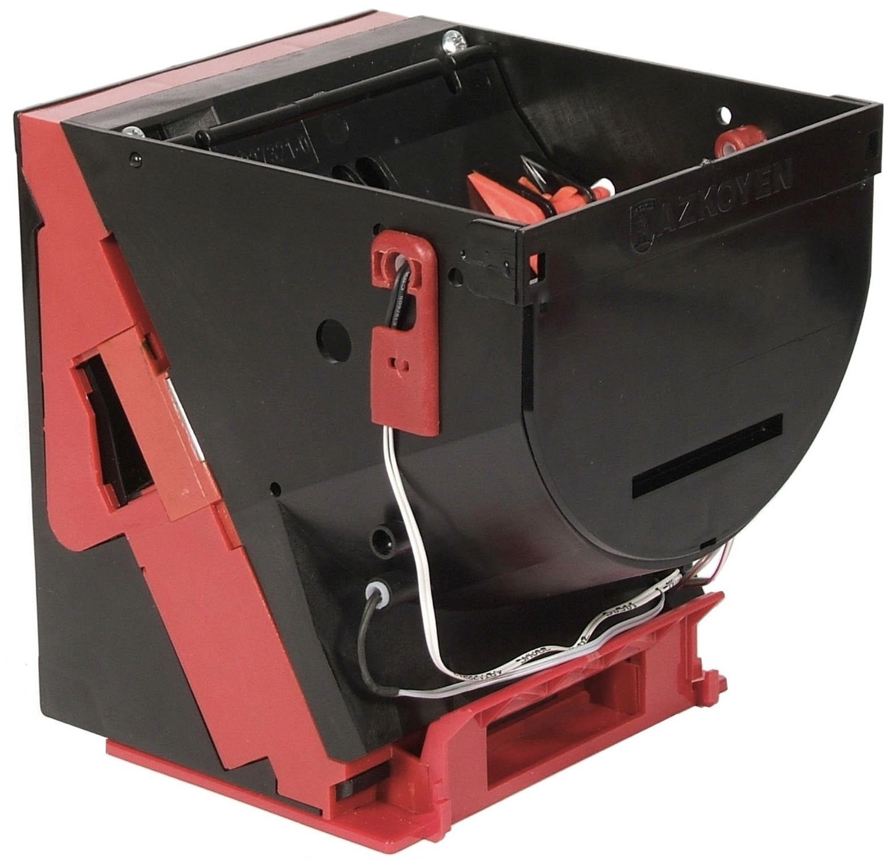
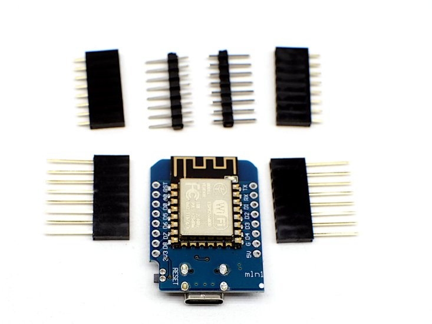

# 🪙 Remote Token Dispenser

**A WiFi-controlled token/coin dispenser system for automating physical token distribution.**

Transform an industrial coin hopper into a smart, network-connected dispenser! Perfect for clubs, makerspaces, saunas, laundromats, or any facility that uses tokens for service access.

---

## 🎯 Why This Project?

Imagine walking up to a sauna, tapping your RFID card, and **hearing coins drop** into the collection tray—all without human intervention. That's the magic of physical feedback in a digital world!

**This project bridges the gap between:**
- 💳 **Digital payments** (cards, apps, online systems)
- 🪙 **Physical tokens** (existing coin-operated equipment)

Instead of replacing all your legacy coin-operated equipment (expensive and wasteful), just automate the token dispensing! Keep using your reliable mechanical systems while adding modern payment methods.

---

## 🚀 Project Goals

### Primary Goals
- **Automate token distribution** for existing token/coin-operated systems
- **Enable modern payment methods** (RFID cards, mobile apps, remote backend)
- **Maintain auditability** with local transaction logging and crash recovery
- **Eliminate manual token handling** (no more token sales desk, no change-making)

### Technical Goals
- **Crash-resistant** - Survives power loss mid-transaction with exact token counts
- **Network-resilient** - Works offline, syncs when connection restored
- **Idempotent operations** - Safe retries, no double-dispensing
- **Industrial-grade hardware** - Azkoyen Hopper U-II (thousands of dispenses)

### Fun Goals
- **Satisfying mechanical feedback** - That coin-drop sound never gets old! 🎵
- **IoT with real-world impact** - Not just blinking LEDs, actual useful automation
- **Learn embedded systems** - ESP8266, interrupts, state machines, HTTP APIs
- **Solve a real problem** - Used in actual facilities with real users

---

## Development Tools

### Mock Dispenser

Local development server that simulates the ESP8266 dispenser without hardware:

```bash
cd dispenser-mock
go run .
```

See [dispenser-mock/README.md](dispenser-mock/README.md) for details.

---

## 🏗️ System Architecture

```
┌─────────────────────┐          ┌──────────────────┐          ┌─────────────────┐
│  Client Device      │  WiFi    │  ESP8266         │  GPIO    │ Azkoyen Hopper  │
│  (Raspberry Pi,     │  HTTP    │  (Wemos D1 Mini) │─────────▶│ U-II            │
│   phone, server)    │─────────▶│  HTTP Server     │          │ Industrial      │
│  - RFID/UI          │          │  State Machine   │◄─────────│ Coin Dispenser  │
│  - Auth/Payment     │          │  Crash Recovery  │  Sensors │ 12V Motor       │
│  - Transaction DB   │          │  Jam Detection   │          │ Opto Sensors    │
└─────────────────────┘          └──────────────────┘          └─────────────────┘
```

**Three components:**
1. **Client Device** - User interface and business logic (this repo focuses on the dispenser API)
2. **ESP8266 Firmware** - WiFi-connected controller with HTTP API
3. **Azkoyen Hopper U-II** - Industrial token dispenser (see [manual](https://www.casino-software.de/download/hopper-azkoyen-u2-manual.pdf))

---

## ✨ Key Features

### For Users
- 💳 **Tap RFID card** → coins immediately dispense (no waiting, no change)
- 📱 **Mobile app purchase** → walk to dispenser → collect tokens
- 🔄 **Fair reconciliation** - System tracks exact tokens dispensed, even during power failures
- ⚡ **Fast dispense** - ~2.5 seconds per token

### For Operators
- 📊 **Real-time metrics** - Total dispenses, success rate, jam detection
- 🚨 **Instant alerts** - Jam or low hopper status via health monitoring
- 💾 **Crash recovery** - Exact token counts preserved across power cycles
- 🔒 **Secure API** - API key authentication, no anonymous access
- 🌐 **Works offline** - Client device queues transactions, syncs when online

### For Developers
- 🎨 **Clean architecture** - Modular ESP8266 firmware with clear separation of concerns
- 🔧 **Idempotent API** - Safe retries, client-controlled transaction IDs
- 📡 **HTTP REST API** - Simple integration with any language or platform
- 🧪 **Crash-safe state machine** - Flash persistence survives power loss
- 📝 **Comprehensive docs** - Architecture, protocol spec, API reference

---

## ⚠️ Before You Start - Critical Setup Requirements

**These configurations are mandatory. Incorrect settings will cause motor control failures:**

### 1. Hopper Configuration: NEGATIVE Mode

The Azkoyen Hopper U-II has a DIP switch for control signal polarity. **It MUST be set to NEGATIVE mode.**

- ✅ Correct: **NEGATIVE** mode (active LOW - control pin LOW = motor ON)
- ❌ Wrong: POSITIVE mode (causes inverted motor behavior)

**Symptom of wrong mode:** Motor doesn't engage during dispense, or engages at wrong times.

**How to fix:** Open hopper, locate DIP switches, set "NEGATIVE/POSITIVE" switch to NEGATIVE position.

See [hardware/README.md](hardware/README.md#-critical-configuration-requirements) for detailed instructions.

---

### 2. Optocoupler Resistor Modification Required

The PC817 optocoupler modules (bestep brand) require hardware modification for reliable operation.

**What to modify:**
- Motor control optocoupler (channel #1): Add 330Ω resistor in parallel with R1 (stock 1kΩ)
- This provides proper 13.3mA drive current for saturation

**Without this modification:**
- Output voltage won't drop low enough (stays at 3-7V instead of < 0.5V)
- Motor control unreliable or non-functional

See [hardware/README.md - Electronic Components](hardware/README.md#electronic-components) for modification procedure.

---

## 🛠️ Hardware Requirements

<p align="center">
  
  <br>
  <em>Azkoyen Hopper U-II - Industrial coin/token dispenser</em>
  <br><br>
  
  <br>
  <em>Wemos D1 Mini - ESP8266 WiFi controller</em>
</p>

| Component | Specification | Purpose |
|-----------|--------------|---------|
| **Azkoyen Hopper U-II** | Industrial coin/token dispenser | Mechanical dispense unit |
| **Wemos D1 Mini** | ESP8266-based dev board | WiFi controller |
| **12V Power Supply** | 2A minimum | Hopper motor power |
| **PC817 Optocouplers** | 4× modules (bestep) | Galvanic isolation |
| **Jumper wires** | - | GPIO connections |

**Hopper Configuration:**
- Operating mode: **PULSES** (30ms pulse per token)
- Voltage: 12V DC
- Manual: [Azkoyen U-II PDF](https://www.casino-software.de/download/hopper-azkoyen-u2-manual.pdf)

**📖 [Complete Hardware Setup Guide →](hardware/README.md)**

Detailed assembly instructions, wiring diagrams, safety considerations, and troubleshooting.

---

## 📂 Project Structure

```
remote-token-dispenser/
├── firmware/                    # ESP8266 firmware (Arduino)
│   ├── dispenser/              # Main Arduino sketch
│   │   ├── dispenser.ino       # Setup and main loop
│   │   ├── config.h            # WiFi, pins, constants
│   │   ├── http_server.*       # HTTP endpoints
│   │   ├── dispense_manager.*  # State machine
│   │   ├── hopper_control.*    # GPIO and interrupts
│   │   └── flash_storage.*     # Crash recovery
│   └── README.md               # Firmware setup guide
├── docs/
│   ├── ARCHITECTURE.md         # System design
│   ├── dispenser-protocol.md   # HTTP API specification
│   └── plans/                  # Design documents
├── CLAUDE.md                    # Development context
└── README.md                    # This file
```

---

## 🚦 Quick Start

### 1. Flash Firmware to ESP8266

See [firmware/README.md](firmware/README.md) for detailed setup instructions.

**Quick summary:**
```bash
# 1. Install Arduino IDE + ESP8266 board support
# 2. Install libraries: ESPAsyncWebServer, ESPAsyncTCP, ArduinoJson
# 3. Configure credentials in firmware/dispenser/config.local.h
# 4. Flash to Wemos D1 Mini
```

### 2. Wire Hardware

Connect ESP8266 to Azkoyen Hopper (see [hardware/README.md](hardware/README.md) for complete wiring):
- **D1** (GPIO5) → Motor control output (via PC817 optocoupler #1) - **Active LOW** (with NEGATIVE mode)
  - ⚠️ **Requires optocoupler R1 modification** (330Ω parallel resistor)
  - Wiring: D1→IN+, so GPIO HIGH = motor ON
- **D7** (GPIO13) ← Coin pulse input (via PC817 optocoupler #2) - **Active LOW**
- **D5** (GPIO14) ← Error signal input (via PC817 optocoupler #3) - **Active LOW**
- **D6** (GPIO12) ← Empty sensor input (via PC817 optocoupler #4) - **Active LOW**
- **12V supply** → Hopper motor + voltage regulator (separate from ESP)
- **Galvanic isolation** provided by PC817 modules

### 3. Test API

```bash
# Health check (no auth)
curl http://192.168.4.20/health

# Dispense 3 tokens (requires API key)
curl -X POST http://192.168.4.20/dispense \
  -H "X-API-Key: your-secret-key" \
  -H "Content-Type: application/json" \
  -d '{"tx_id":"abc123","quantity":3}'

# Check status
curl -H "X-API-Key: your-secret-key" \
  http://192.168.4.20/dispense/abc123
```

---

## 📖 Documentation

- **[hardware/README.md](hardware/README.md)** - Hardware assembly guide with wiring diagrams
- **[ARCHITECTURE.md](ARCHITECTURE.md)** - Complete system design with diagrams
- **[dispenser-protocol.md](dispenser-protocol.md)** - HTTP API specification
- **[firmware/README.md](firmware/README.md)** - ESP8266 firmware setup
- **[CLAUDE.md](CLAUDE.md)** - Development context for AI assistants

---

## 🎮 Use Cases

### Example: Sauna Club
1. Member taps RFID card at terminal
2. Raspberry Pi authorizes transaction (local DB + optional backend sync)
3. Pi sends HTTP request to dispenser: `POST /dispense`
4. ESP8266 activates hopper, counts tokens via interrupt
5. Member collects 2 EUR coins from tray
6. Member inserts coins into sauna
7. Transaction logged locally, synced to backend when online

### Example: Laundromat
- Customers buy tokens via mobile app
- Walk to dispenser kiosk, scan QR code
- Tokens immediately dispense
- Use tokens in legacy coin-operated washers/dryers

### Example: Game Arcade
- Online token purchase system
- Physical token redemption on-site
- Preserves the tactile experience of arcade tokens
- Integrates with modern payment processing

---

## 🔧 Technical Highlights

### Dispense-First, Pay-After Model
Unlike traditional payment systems, tokens are **physically dispensed before payment processing**. This eliminates:
- Risk of payment failures after token dispense (refund complexity)
- Need for payment gateway uptime during dispense
- Payment provider transaction fees for refunds

The exact token count is recorded even during crashes, enabling accurate reconciliation.

### Crash Recovery
Every state transition is persisted to flash memory:
```cpp
{tx_id: "abc123", quantity: 3, dispensed: 2, state: "error"}
```
On reboot after power loss, the system resumes from the exact state, preserving partial dispense counts.

### Jam Detection
Watchdog timer monitors token dispense:
- Expected: One token every ~2.5 seconds
- Timeout: 5 seconds without token pulse = jam detected
- Action: Stop motor, record partial count, require manual reset

---

## 🤝 Contributing

This project is designed to be educational and extensible! Contributions welcome:
- 🐛 Bug reports and fixes
- 📝 Documentation improvements
- ✨ Feature additions (web UI, mobile app, etc.)
- 🧪 Hardware compatibility (other hoppers, other microcontrollers)

---

## 📜 License

See repository for license information.

---

## 🙏 Acknowledgments

- **Azkoyen** - For building reliable industrial hoppers
- **ESP8266 Community** - For the Arduino core and libraries
- **Casino Software GmbH** - For hosting the [hopper manual](https://www.casino-software.de/download/hopper-azkoyen-u2-manual.pdf)

---

## 💡 Why Physical Tokens?

In an increasingly digital world, there's something deeply satisfying about the **tangible interaction** with physical tokens:

- **Sensory feedback** - The weight of coins, the sound of dispensing, the clink in the tray
- **No screen fatigue** - Simple, universally understood interface
- **Legacy equipment** - Millions of reliable coin-operated devices worldwide
- **No single point of failure** - Tokens work even if your phone dies or the network fails
- **Gaming psychology** - Physical tokens feel different from digital credits

This project lets you **keep the physical experience while adding digital convenience**. Best of both worlds! 🌟

---

**Built with ❤️ for makerspaces, clubs, and anyone who loves the sound of coins dropping into a tray.**
