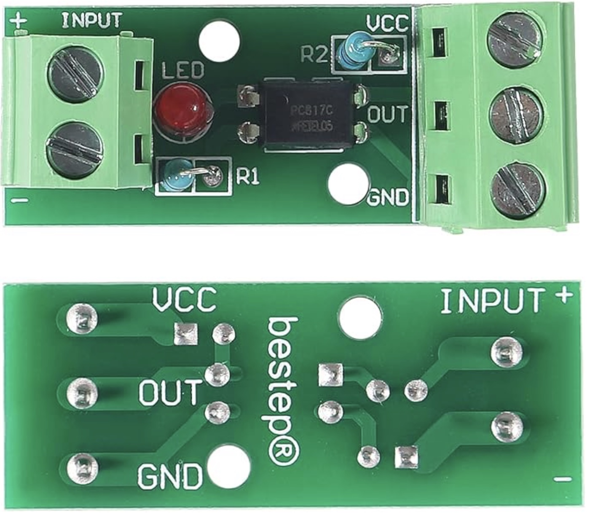
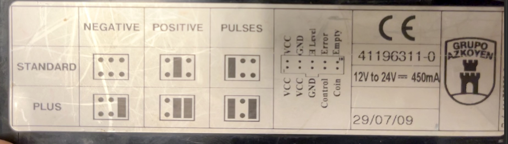
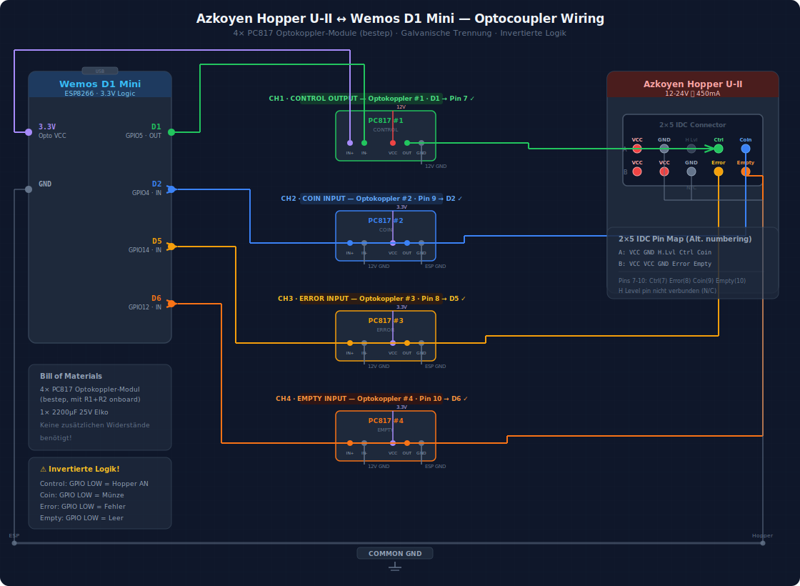
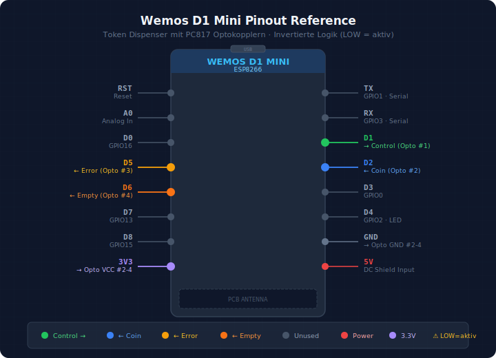
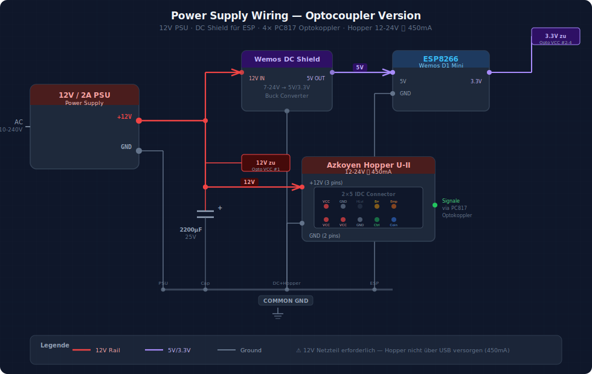
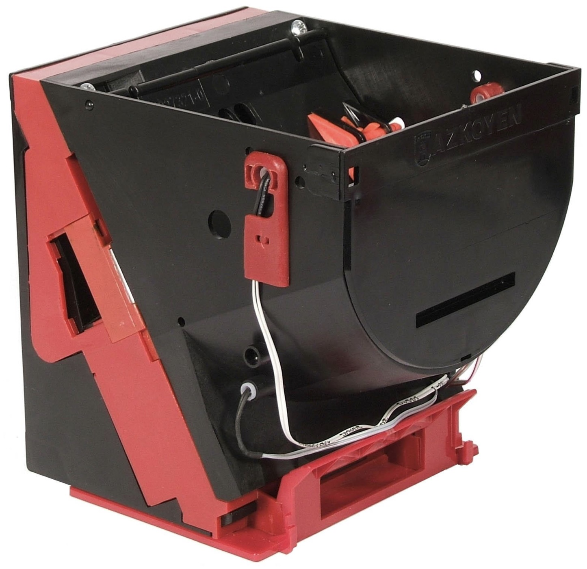
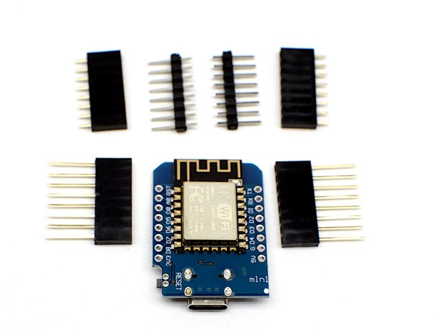

# Hardware Setup Guide

This guide covers the physical hardware assembly for the Remote Token Dispenser system.

---

## 📦 Components

### Core Hardware

| Component | Model | Purpose | Cost Estimate |
|-----------|-------|---------|---------------|
| **Coin Dispenser** | Azkoyen Hopper U-II (used) | Industrial token/coin dispensing | ~€30 |
| **WiFi Controller** | Wemos D1 Mini (ESP8266) | HTTP server, state machine | ~€5 |
| **Power Supply** | 12V/2A DC adapter | Hopper motor power | ~€10 |
| **Optocouplers** | 4× PC817 modules (bestep) | Galvanic isolation, signal conditioning | ~€5 |
| **Capacitor** | 2200µF 25V electrolytic | Motor startup surge protection | ~€1 |

### Electronic Components

**Required components:**

| Component | Quantity | Purpose |
|-----------|----------|---------|
| PC817 optocoupler modules (bestep brand) | 4 | Galvanic isolation with onboard resistors |
| 2200µF 25V capacitor | 1 | Motor startup surge protection |

**Note:** PC817 modules include onboard current-limiting resistors (R1+R2). No additional resistors needed!

  
   
  <em>PC817 optocoupler module showing INPUT/OUTPUT terminals, LED indicator, and onboard R1/R2 resistors</em>

### Supporting Hardware

- Jumper wires (male-to-female, 20cm)
- Breadboard or perfboard for resistor assembly
- USB cable (for ESP8266 programming)
- Enclosure/junction box (optional, for protection)
- Wire terminals and connectors

**Total Cost:** ~€50-55 (excluding enclosure)

---

## 🔌 Wiring Diagrams

### Azkoyen Hopper Connector Pinout

  
   
  <em>Azkoyen Hopper U-II - 2x5 Molex connector pinout</em>

**Connector Pins (2x5 Molex):**
- **VCC (1, 2, 3)** - Three 12V power inputs (all connected together)
- **GND (3, 4)** - Two ground pins (both connected to common ground)
- **Control (5)** - Dispense command input
- **Coin (6)** - Pulse output (~18ms per coin dispensed)
- **H Level (7)** - Hopper full detection (optional, not connected)
- **Error (8)** - Jam/motor error signal output
- **Empty (9)** - Coin bay empty signal output

---

### Main Wiring: ESP8266 ↔ Hopper

  
   
  <em>Complete wiring schematic showing PC817 optocoupler modules for galvanic isolation</em>

**Key connections:**
- **D1 (GPIO5)** → Control output (via PC817 optocoupler #1) - **⚠️ Active LOW: GPIO LOW = motor ON**
- **D2 (GPIO4)** ← Coin pulse input (via PC817 optocoupler #2) - **Active LOW**
- **D5 (GPIO14)** ← Error signal input (via PC817 optocoupler #3) - **Active LOW**
- **D6 (GPIO12)** ← Empty sensor input (via PC817 optocoupler #4) - **Active LOW**
- **GND** → Common ground (essential for all circuits!)

---

### Pinout Reference: Wemos D1 Mini

  
   
  <em>Wemos D1 Mini pinout with used pins highlighted in red</em>

**Used pins (highlighted in red):**
- **D1 (GPIO5)** - Control output (via PC817 optocoupler #1) - **Active LOW**
- **D2 (GPIO4)** - Coin pulse interrupt input (via PC817 optocoupler #2) - **Active LOW**
- **D5 (GPIO14)** - Error signal input (via PC817 optocoupler #3) - **Active LOW**
- **D6 (GPIO12)** - Empty sensor input (via PC817 optocoupler #4) - **Active LOW**

---

### Power Supply Wiring

  
   
  <em>Power supply connections with voltage regulator and common ground</em>

**Critical power requirements:**
- **12V/2A power supply** for hopper motor and voltage regulator
- **Voltage regulator** (12V→5V) powers ESP8266 (NOT USB in production)
- **Common ground** between all components (absolutely required!)
- **2200µF capacitor** across 12V rail absorbs motor startup surge
- All 3 hopper VCC pins connected to +12V
- Both hopper GND pins connected to common ground

---

## 🔧 Assembly Instructions

### Step 1: Configure the Hopper

The Azkoyen Hopper U-II must be configured in **PULSES** mode:

1. Open the hopper (4 screws on top panel)
2. Locate the DIP switches inside (usually near the motor)
3. Set to **PULSES** mode (30ms pulse per coin)
   - Refer to [Azkoyen U-II manual](https://www.casino-software.de/download/hopper-azkoyen-u2-manual.pdf) for exact switch positions
4. Close and test manually (should click 30ms per coin)

### Step 2: Wire the Power Supply

**⚠️ POWER OFF during wiring!**

1. Connect **12V PSU ground** to **hopper GND** pin
2. Connect **12V PSU positive** to **hopper 12V** pin
3. Solder **2200µF capacitor** across 12V and GND (observe polarity!)
   - Negative stripe on capacitor → GND
   - Positive lead → 12V
4. Keep ESP8266 powered separately via USB

### Step 3: Wire the Control Signals via PC817 Optocouplers

**Components needed:**
- 4× PC817 optocoupler modules (bestep brand with onboard resistors)
- No additional resistors required!

**⚠️ INVERTED LOGIC:** GPIO LOW = motor ON, inputs read LOW when active

1. **Control output (D1 → PC817 #1 → Hopper Control):**
   - Connect D1 (GPIO5) → PC817 module #1 input side
   - Connect PC817 module #1 output → Hopper "Control" pin
   - Connect module grounds appropriately (galvanic isolation!)
   - **Logic:** D1 LOW = optocoupler ON = motor runs

2. **Coin pulse input (Hopper Coin → PC817 #2 → D2):**
   - Connect Hopper "Coin" pin → PC817 module #2 input side (with 12V)
   - Connect PC817 module #2 output → D2 (GPIO4)
   - Use FALLING edge interrupt on D2
   - **Signal is active LOW** (optocoupler inverts)

3. **Error signal input (Hopper Error → PC817 #3 → D5):**
   - Connect Hopper "Error" pin → PC817 module #3 input side (12V)
   - Connect PC817 module #3 output → D5 (GPIO14)
   - LOW = jam or motor error detected

4. **Empty sensor input (Hopper Empty → PC817 #4 → D6):**
   - Connect Hopper "Empty" pin → PC817 module #4 input side (12V)
   - Connect PC817 module #4 output → D6 (GPIO12)
   - LOW = hopper coin bay is empty

5. **Common ground:**
   - Connect ESP8266 GND to optocoupler output-side grounds
   - Connect hopper GND to optocoupler input-side grounds
   - **Optocouplers provide galvanic isolation between 12V and 3.3V sides**

### Step 4: Test the Wiring

Before powering everything on:

1. **Visual inspection:**
   - Check all connections are secure
   - Verify capacitor polarity (explosion risk if reversed!)
   - Ensure no shorts between 12V and GND

2. **Multimeter test:**
   - Measure 12V supply voltage (should be 11.5-12.5V)
   - Check continuity of ground connections
   - Verify relay switches correctly

3. **Power-on test:**
   - Power ESP8266 via USB first
   - Then power the 12V supply
   - ESP8266 should boot and connect to WiFi
   - No smoke, burning smell, or unusual heat

4. **Dispense test:**
   - Send test dispense via HTTP API
   - Motor should activate
   - Tokens should dispense
   - Pulse count should match dispensed tokens

---

## 🛡️ Safety Considerations

### Electrical Safety

- **Never** power the hopper motor from ESP8266 pins (insufficient current!)
- **Always** use a relay or level shifter for motor control
- **Check** capacitor polarity before powering on
- **Use** proper wire gauge for 12V/2A current (minimum 20 AWG)
- **Fuse** the 12V line (2A fast-blow fuse recommended)

### Mechanical Safety

- **Secure** the hopper firmly (vibration during dispense)
- **Cover** exposed 12V connections (electrical tape or heat shrink)
- **Protect** against moisture (IP54+ enclosure if outdoors)
- **Test** thoroughly before deploying with real currency

### Token Safety

- Use tokens/coins that match hopper specifications
- Avoid corroded or damaged tokens (jam risk)
- Keep hopper clean (dust/debris causes jams)

---

## 🐛 Troubleshooting

### Motor doesn't activate

- **Check:** PC817 optocoupler module #1 connections (input and output sides)
- **Check:** D1 goes LOW when dispensing (inverted logic!)
- **Check:** Optocoupler LED indicator is lit when D1 is LOW
- **Check:** 12V power supply voltage
- **Check:** Common ground on both sides of optocoupler

### Pulse count doesn't increment

- **Check:** D2 connection via PC817 module #2
- **Check:** Optocoupler output goes LOW when coin pulse detected
- **Check:** Hopper is configured in PULSES mode (not LEVEL)
- **Check:** Firmware interrupt is configured for FALLING edge
- **Check:** PC817 module #2 LED indicator blinks during dispense

### Dispense jams frequently

- **Check:** Tokens are clean and not damaged
- **Check:** Hopper is properly calibrated (see manual)
- **Check:** 2200µF capacitor is installed (motor surge protection)
- **Clean:** Hopper interior and opto-sensors

### ESP8266 reboots during dispense

- **Check:** Power supply has sufficient current (2A minimum)
- **Check:** Capacitor is present and functional
- **Check:** ESP8266 has separate power source (not sharing 12V)

---

## 📚 Additional Resources

- **[Azkoyen Hopper U-II Manual](https://www.casino-software.de/download/hopper-azkoyen-u2-manual.pdf)** - Complete hopper documentation
- **[Wemos D1 Mini Pinout](https://www.mischianti.org/wp-content/uploads/2021/06/WeMos-D1-mini-pinout-mischianti-1024x655.png)** - Detailed pin reference
- **[ESP8266 GPIO Documentation](https://randomnerdtutorials.com/esp8266-pinout-reference-gpios/)** - GPIO capabilities and limitations
- **[Diagram Generation](../docs/README-diagrams.md)** - How to regenerate wiring diagrams

---

## 📸 Photos

  
   
  <em>Azkoyen Hopper U-II - Industrial coin/token dispenser</em>
    
  
   
  <em>Wemos D1 Mini - ESP8266 WiFi controller</em>

---

## ✅ Assembly Checklist

Before deploying your token dispenser:

- [ ] Hopper configured in PULSES mode (30ms pulses)
- [ ] 12V power supply connected with 2200µF capacitor
- [ ] Common ground connected on both sides of optocouplers
- [ ] PC817 optocoupler modules installed (4× total, bestep brand)
- [ ] D1 (GPIO5) → PC817 #1 → Hopper Control pin (inverted: LOW = ON)
- [ ] D2 (GPIO4) ← PC817 #2 ← Hopper Coin (active LOW)
- [ ] D5 (GPIO14) ← PC817 #3 ← Hopper Error (active LOW)
- [ ] D6 (GPIO12) ← PC817 #4 ← Hopper Empty (active LOW)
- [ ] All connections visually inspected and tested with multimeter
- [ ] Capacitor polarity verified (critical!)
- [ ] ESP8266 firmware flashed and WiFi configured
- [ ] Test dispense successful (motor runs, tokens dispense, pulses count)
- [ ] API authentication configured (API key set)
- [ ] System tested with 10+ dispenses (no jams, correct counts)
- [ ] Enclosure secured and weatherproofed (if applicable)

---

**Ready to assemble?** Follow the steps above and refer to the wiring diagrams. If you encounter issues, check the troubleshooting section or consult the hopper manual.

**Happy building! 🔧**
