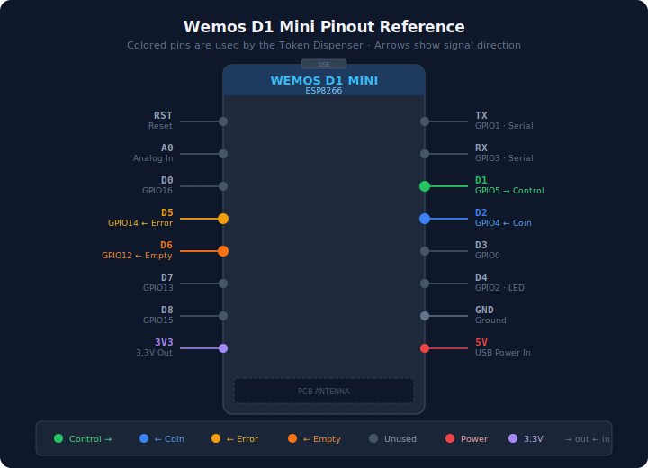

# Hardware Setup Guide

This guide covers the physical hardware assembly for the Remote Token Dispenser system.

---

## 📦 Components

### Core Hardware

| Component | Model | Purpose | Cost Estimate |
|-----------|-------|---------|---------------|
| **Coin Dispenser** | Azkoyen Hopper U-II (used) | Industrial token/coin dispensing | ~€30 |
| **WiFi Controller** | Wemos D1 Mini (ESP8266) | HTTP server, state machine | ~€5 |
| **Power Supply** | 12V/2A DC adapter | Hopper motor power | ~€10 |
| **Transistor** | BC547 NPN | Control output switching | <€1 |
| **Capacitor** | 2200µF 25V electrolytic | Motor startup surge protection | ~€1 |

### Electronic Components

**Required resistors (see combinations below):**

| Component | Quantity | Purpose |
|-----------|----------|---------|
| BC547 NPN transistor | 1 | Control output switching |
| 2200µF 25V capacitor | 1 | Motor startup surge protection |

**Resistors - Option A (Series combination for 3.3kΩ):**
- 10kΩ (¼W) × 4 | R2, R3, R5, R7
- 2kΩ (¼W) × 3 | R4, R6, R8 (part 1)
- 1kΩ (¼W) × 4 | R1, R4, R6, R8 (part 2)
- 330Ω (¼W) × 3 | R4, R6, R8 (part 3)
- **Total: 14 resistors**

**Resistors - Option B (Parallel combination for 3.3kΩ):**
- 10kΩ (¼W) × 7 | R2, R3, R5, R7, R4, R6, R8 (part 1)
- 5kΩ (¼W) × 3 | R4, R6, R8 (part 2)
- 1kΩ (¼W) × 1 | R1
- **Total: 11 resistors**

### Supporting Hardware

- Jumper wires (male-to-female, 20cm)
- Breadboard or perfboard for resistor assembly
- USB cable (for ESP8266 programming)
- Enclosure/junction box (optional, for protection)
- Wire terminals and connectors

**Total Cost:** ~€50-60 (excluding enclosure)

---

## 🔌 Wiring Diagrams

### Azkoyen Hopper Connector Pinout

<p align="center">
  
  <br>
  <em>Azkoyen Hopper U-II - 2x5 Molex connector pinout</em>
</p>

**Connector Pins (2x5 Molex):**
- **VCC (1, 2, 3)** - Three 12V power inputs (all connected together)
- **GND (3, 4)** - Two ground pins (both connected to common ground)
- **Control (5)** - Dispense command input
- **Coin (6)** - Pulse output (~18ms per coin dispensed)
- **H Level (7)** - Hopper full detection (optional, not connected)
- **Error (8)** - Jam/motor error signal output
- **Empty (9)** - Coin bay empty signal output

---

### Main Wiring: ESP8266 ↔ Hopper

<p align="center">
  
  <br>
  <em>Complete wiring schematic showing BC547 transistor and voltage dividers</em>
</p>

**Key connections:**
- **D1 (GPIO5)** → Control output (via BC547 NPN transistor + R1: 1kΩ, R2: 10kΩ pull-up)
- **D2 (GPIO4)** ← Coin pulse input (via R3/R4: 10kΩ/3.3kΩ voltage divider)
- **D5 (GPIO14)** ← Error signal input (via R5/R6: 10kΩ/3.3kΩ voltage divider)
- **D6 (GPIO12)** ← Empty sensor input (via R7/R8: 10kΩ/3.3kΩ voltage divider)
- **GND** → Common ground (essential for all circuits!)

---

### Pinout Reference: Wemos D1 Mini

<p align="center">
  
  <br>
  <em>Wemos D1 Mini pinout with used pins highlighted in red</em>
</p>

**Used pins (highlighted in red):**
- **D1 (GPIO5)** - Control output (via BC547 transistor)
- **D2 (GPIO4)** - Coin pulse interrupt input (via voltage divider)
- **D5 (GPIO14)** - Error signal input (via voltage divider)
- **D6 (GPIO12)** - Empty sensor input (via voltage divider)

---

### Power Supply Wiring

<p align="center">
  
  <br>
  <em>Power supply connections with voltage regulator and common ground</em>
</p>

**Critical power requirements:**
- **12V/2A power supply** for hopper motor and voltage regulator
- **Voltage regulator** (12V→5V) powers ESP8266 (NOT USB in production)
- **Common ground** between all components (absolutely required!)
- **2200µF capacitor** across 12V rail absorbs motor startup surge
- All 3 hopper VCC pins connected to +12V
- Both hopper GND pins connected to common ground

---

## 🔬 Resistor Configurations

The circuit requires specific resistor values. If you don't have exact values, you can combine standard resistors:

### BC547 Transistor Circuit

**R1 (Base Resistor):** 1kΩ
- Use: 1× 1kΩ resistor ✅

**R2 (Pull-up Resistor):** 10kΩ
- Use: 1× 10kΩ resistor ✅

### Voltage Dividers (×3 for Coin, Error, Empty)

Target: **10kΩ (top) + 3.3kΩ (bottom)** to convert 12V → 3.0V

**Top Resistor (R3, R5, R7):** 10kΩ each
- Use: 3× 10kΩ resistors ✅

**Bottom Resistor (R4, R6, R8):** 3.3kΩ each

#### Option A: Series Combination (RECOMMENDED if you have these values)

```
Bottom = 2kΩ + 1kΩ + 330Ω (in series) = 3.33kΩ ✅

Hopper Signal ──[10kΩ]──┬── To Wemos GPIO
                         │
                     [2kΩ]   ← Series
                         │
                     [1kΩ]   ← Series
                         │
                     [330Ω]  ← Series
                         │
                        GND
```

**Per divider:** 1× 10kΩ + 1× 2kΩ + 1× 1kΩ + 1× 330Ω

**For 3 dividers:**
- 3× 10kΩ (tops)
- 3× 2kΩ (bottom part 1)
- 3× 1kΩ (bottom part 2)
- 3× 330Ω (bottom part 3)

**Voltage:** 12V × (3.33 / 13.33) = **3.0V** ✅

---

#### Option B: Parallel Combination (if you have 5kΩ resistors)

```
Bottom = 10kΩ || 5kΩ (in parallel) = 3.33kΩ ✅

Hopper Signal ──[10kΩ]──┬── To Wemos GPIO
                         │
                      ┌──┴──┐
                      │     │
                    [10kΩ][5kΩ]  ← Parallel
                      │     │
                      └──┬──┘
                         │
                        GND
```

**Per divider:** 1× 10kΩ (top) + 1× 10kΩ + 1× 5kΩ (parallel bottom)

**For 3 dividers:**
- 3× 10kΩ (tops)
- 3× 10kΩ (bottom part 1)
- 3× 5kΩ (bottom part 2)

**Voltage:** 12V × (3.33 / 13.33) = **3.0V** ✅

---

### Complete Bill of Materials

**Option A (14 resistors total):**
- 10kΩ × 4 (R2 + R3, R5, R7)
- 2kΩ × 3 (R4, R6, R8 part 1)
- 1kΩ × 4 (R1 + R4, R6, R8 part 2)
- 330Ω × 3 (R4, R6, R8 part 3)

**Option B (11 resistors total):**
- 10kΩ × 7 (R2 + R3, R5, R7 + R4, R6, R8 part 1)
- 5kΩ × 3 (R4, R6, R8 part 2)
- 1kΩ × 1 (R1)

**Choose Option A if:**
- You have 2kΩ, 1kΩ, and 330Ω resistors
- You have limited 10kΩ resistors

**Choose Option B if:**
- You have plenty of 10kΩ and 5kΩ resistors
- You prefer fewer solder joints (2 vs 3 per divider)

⚠️ **DO NOT use 10kΩ + 5kΩ in series!** This gives 4.0V which will damage the ESP8266!

---

## 🔧 Assembly Instructions

### Step 1: Configure the Hopper

The Azkoyen Hopper U-II must be configured in **PULSES** mode:

1. Open the hopper (4 screws on top panel)
2. Locate the DIP switches inside (usually near the motor)
3. Set to **PULSES** mode (30ms pulse per coin)
   - Refer to [Azkoyen U-II manual](https://www.casino-software.de/download/hopper-azkoyen-u2-manual.pdf) for exact switch positions
4. Close and test manually (should click 30ms per coin)

### Step 2: Wire the Power Supply

**⚠️ POWER OFF during wiring!**

1. Connect **12V PSU ground** to **hopper GND** pin
2. Connect **12V PSU positive** to **hopper 12V** pin
3. Solder **2200µF capacitor** across 12V and GND (observe polarity!)
   - Negative stripe on capacitor → GND
   - Positive lead → 12V
4. Keep ESP8266 powered separately via USB

### Step 3: Wire the Control Signals

**Components needed:**
- BC547 NPN transistor (Q1)
- Resistors: 1kΩ (R1), 10kΩ (R2, R3, R5, R7), 3.3kΩ (R4, R6, R8)
- Optional: 100nF capacitor for debouncing

1. **Control output (D1 → BC547 → Hopper Control):**
   - Connect D1 → 1kΩ resistor (R1) → BC547 base
   - Connect BC547 collector → 10kΩ pull-up (R2) → +12V
   - Connect BC547 collector → Hopper "Control" pin
   - Connect BC547 emitter → GND
   - Logic: D1 HIGH = transistor ON = Control LOW = hopper dispenses

2. **Coin pulse input (Hopper Coin → voltage divider → D2):**
   - Hopper "Coin" pin → 10kΩ resistor (R3) → junction → D2
   - Junction → 3.3kΩ resistor (R4) → GND
   - Voltage divider steps 12V down to ~2.98V (safe for 3.3V GPIO)
   - Use RISING or FALLING edge interrupt on D2

3. **Error signal input (Hopper Error → voltage divider → D5):**
   - Hopper "Error" pin → 10kΩ resistor (R5) → junction → D5
   - Junction → 3.3kΩ resistor (R6) → GND
   - HIGH (~2.98V) = jam or motor error detected

4. **Empty sensor input (Hopper Empty → voltage divider → D6):**
   - Hopper "Empty" pin → 10kΩ resistor (R7) → junction → D6
   - Junction → 3.3kΩ resistor (R8) → GND
   - HIGH (~2.98V) = hopper coin bay is empty

5. **Common ground:**
   - Connect ESP8266 GND to hopper GND
   - Connect all voltage divider bottoms to common GND
   - **This is critical for signal integrity!**

### Step 4: Test the Wiring

Before powering everything on:

1. **Visual inspection:**
   - Check all connections are secure
   - Verify capacitor polarity (explosion risk if reversed!)
   - Ensure no shorts between 12V and GND

2. **Multimeter test:**
   - Measure 12V supply voltage (should be 11.5-12.5V)
   - Check continuity of ground connections
   - Verify relay switches correctly

3. **Power-on test:**
   - Power ESP8266 via USB first
   - Then power the 12V supply
   - ESP8266 should boot and connect to WiFi
   - No smoke, burning smell, or unusual heat

4. **Dispense test:**
   - Send test dispense via HTTP API
   - Motor should activate
   - Tokens should dispense
   - Pulse count should match dispensed tokens

---

## 🛡️ Safety Considerations

### Electrical Safety

- **Never** power the hopper motor from ESP8266 pins (insufficient current!)
- **Always** use a relay or level shifter for motor control
- **Check** capacitor polarity before powering on
- **Use** proper wire gauge for 12V/2A current (minimum 20 AWG)
- **Fuse** the 12V line (2A fast-blow fuse recommended)

### Mechanical Safety

- **Secure** the hopper firmly (vibration during dispense)
- **Cover** exposed 12V connections (electrical tape or heat shrink)
- **Protect** against moisture (IP54+ enclosure if outdoors)
- **Test** thoroughly before deploying with real currency

### Token Safety

- Use tokens/coins that match hopper specifications
- Avoid corroded or damaged tokens (jam risk)
- Keep hopper clean (dust/debris causes jams)

---

## 🐛 Troubleshooting

### Motor doesn't activate

- **Check:** BC547 transistor wiring (collector, base, emitter)
- **Check:** R1 (1kΩ) and R2 (10kΩ) resistor values
- **Check:** D1 goes HIGH when dispensing (3.3V at base resistor)
- **Check:** 12V power supply voltage
- **Check:** Common ground connection

### Pulse count doesn't increment

- **Check:** D2 connection via voltage divider (R3: 10kΩ, R4: 3.3kΩ)
- **Check:** Voltage at D2 is ~2.98V when hopper Coin pin is HIGH
- **Check:** Hopper is configured in PULSES mode (not LEVEL)
- **Check:** Firmware interrupt is configured for correct edge

### Dispense jams frequently

- **Check:** Tokens are clean and not damaged
- **Check:** Hopper is properly calibrated (see manual)
- **Check:** 2200µF capacitor is installed (motor surge protection)
- **Clean:** Hopper interior and opto-sensors

### ESP8266 reboots during dispense

- **Check:** Power supply has sufficient current (2A minimum)
- **Check:** Capacitor is present and functional
- **Check:** ESP8266 has separate power source (not sharing 12V)

---

## 📚 Additional Resources

- **[Azkoyen Hopper U-II Manual](https://www.casino-software.de/download/hopper-azkoyen-u2-manual.pdf)** - Complete hopper documentation
- **[Wemos D1 Mini Pinout](https://www.mischianti.org/wp-content/uploads/2021/06/WeMos-D1-mini-pinout-mischianti-1024x655.png)** - Detailed pin reference
- **[ESP8266 GPIO Documentation](https://randomnerdtutorials.com/esp8266-pinout-reference-gpios/)** - GPIO capabilities and limitations
- **[Diagram Generation](../docs/README-diagrams.md)** - How to regenerate wiring diagrams

---

## 📸 Photos

<p align="center">
  
  <br>
  <em>Azkoyen Hopper U-II - Industrial coin/token dispenser</em>
  <br><br>
  
  <br>
  <em>Wemos D1 Mini - ESP8266 WiFi controller</em>
</p>

---

## ✅ Assembly Checklist

Before deploying your token dispenser:

- [ ] Hopper configured in PULSES mode (30ms pulses)
- [ ] 12V power supply connected with 2200µF capacitor
- [ ] Common ground connected between ESP8266 and hopper
- [ ] BC547 transistor installed with R1 (1kΩ) and R2 (10kΩ)
- [ ] D1 → BC547 base (via 1kΩ resistor)
- [ ] BC547 collector → Hopper Control pin (via 10kΩ pull-up to 12V)
- [ ] D2 ← Hopper Coin (via 10kΩ/3.3kΩ voltage divider)
- [ ] D5 ← Hopper Error (via 10kΩ/3.3kΩ voltage divider)
- [ ] D6 ← Hopper Empty (via 10kΩ/3.3kΩ voltage divider)
- [ ] All connections visually inspected and tested with multimeter
- [ ] Capacitor polarity verified (critical!)
- [ ] ESP8266 firmware flashed and WiFi configured
- [ ] Test dispense successful (motor runs, tokens dispense, pulses count)
- [ ] API authentication configured (API key set)
- [ ] System tested with 10+ dispenses (no jams, correct counts)
- [ ] Enclosure secured and weatherproofed (if applicable)

---

**Ready to assemble?** Follow the steps above and refer to the wiring diagrams. If you encounter issues, check the troubleshooting section or consult the hopper manual.

**Happy building! 🔧**
