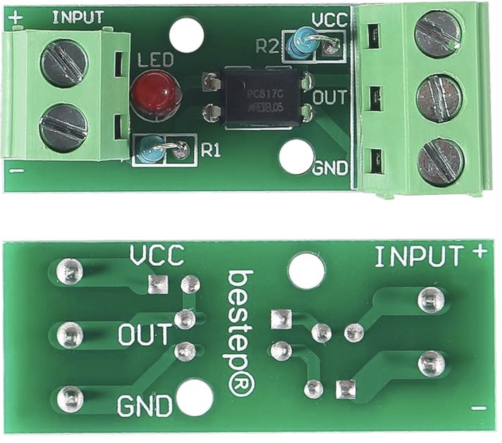
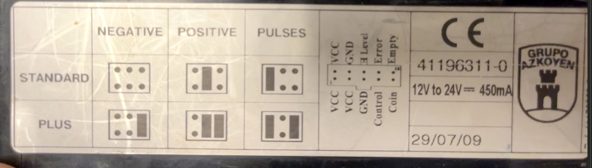
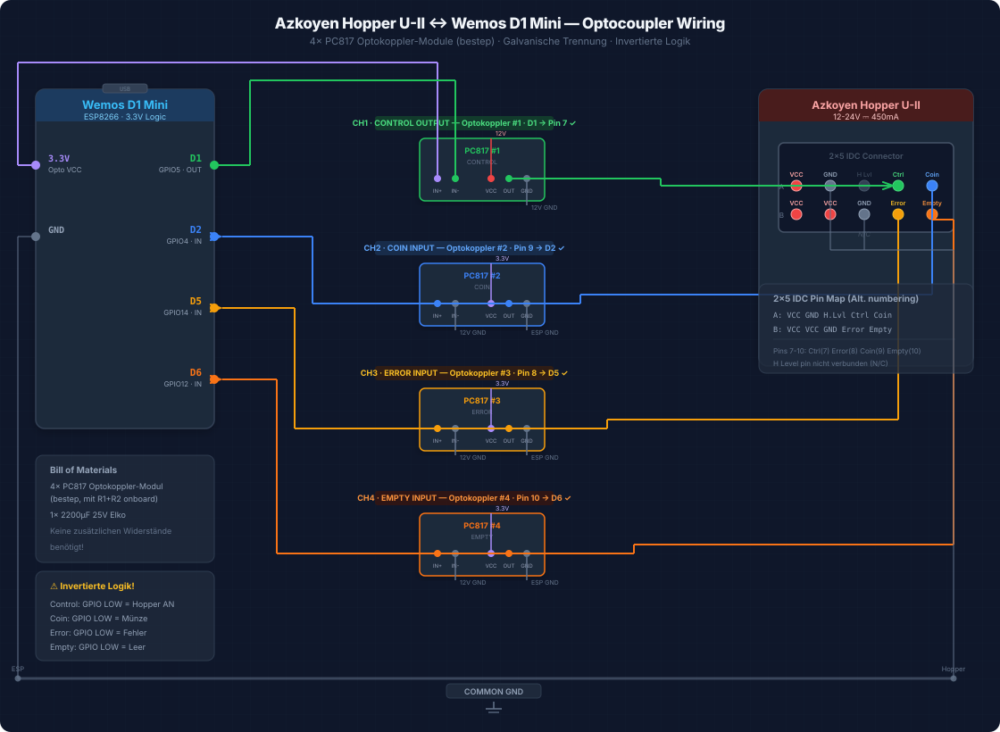
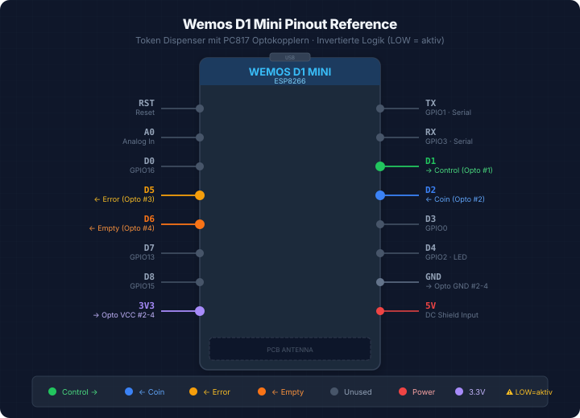
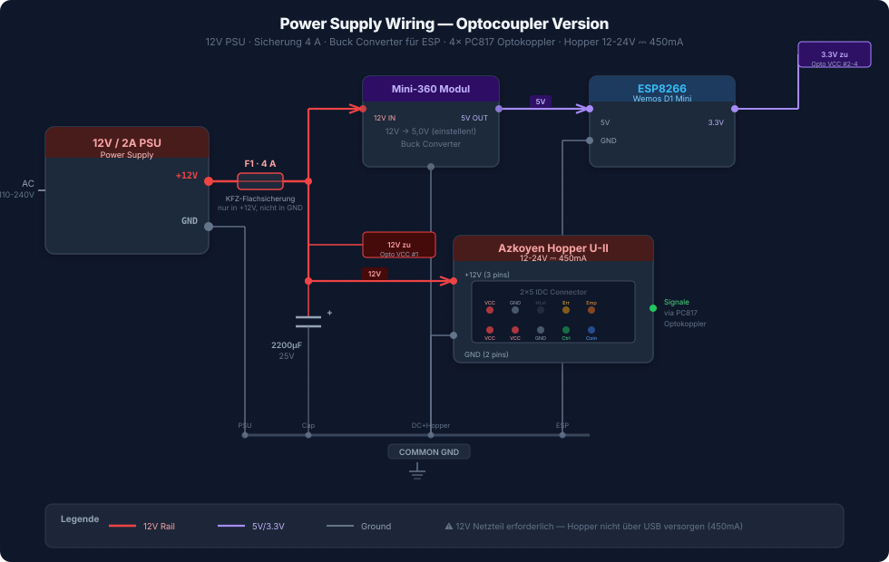

# Hardware Setup Guide

This guide covers the physical hardware assembly for the Remote Token Dispenser system.

---

## ⚠️ CRITICAL CONFIGURATION REQUIREMENTS

**READ THIS FIRST - These settings are mandatory or the motor will not work correctly:**

### 1. Hopper DIP Switch: NEGATIVE Mode Required

The Azkoyen Hopper U-II **MUST** be configured in **NEGATIVE mode** (active LOW control).

**Official specification:** See `docs/azkoyen-hopper-protocol.md` section 2.1

- ✅ **NEGATIVE mode:** Control pin LOW (< 0.5V) = motor ON, control pin HIGH (> 4V) = motor OFF
- ❌ **POSITIVE mode:** Will cause inverted behavior - motor runs at wrong times

**DIP switch configuration:**
- Required setting: **STANDARD + NEGATIVE** (see protocol doc section 5 for DIP matrix)
- Connector #6 on hopper control board

**How to set:**
1. Open hopper (4 screws on top panel)
2. Locate DIP switches (connector #6 near motor/circuit board)
3. Set to STANDARD + NEGATIVE configuration per protocol diagram
4. Close hopper and test

**Symptoms of wrong mode:**
- Motor doesn't engage during dispense request
- Motor engages AFTER timeout/error instead of during dispense
- Backwards behavior compared to LED indicator

**Reference:** Azkoyen protocol section 2.1 (NEGATIVE Logic Mode)

---

### 2. PC817 Optocoupler Resistor Modifications Required

The bestep brand PC817 optocoupler modules ship with **inadequate resistor values** that prevent proper motor control.

**Stock resistor values (DON'T WORK):**
- R1 (input) = 1kΩ → Provides only 3.3mA drive current (too weak!)
- R2 (output) = 10kΩ → Creates voltage divider with hopper input (unreliable voltages)

**Required modifications:**

| Resistor | Location | Stock Value | Add in Parallel | Result | Purpose |
|----------|----------|-------------|-----------------|--------|---------|
| R1 | Input side | 1kΩ | 330Ω | 248Ω total | 13.3mA drive current for saturation |
| R2 | Output side | 10kΩ | *(remove)* | 10kΩ | Weak pull-up works with modification |

**Why this matters:**
- Without R1 modification: Phototransistor won't saturate, OUT stays at ~3-7V instead of 0V
- With weak R2: Hopper input impedance creates voltage divider (6V instead of 12V)
- Result: Unreliable motor control, inconsistent operation

**How to modify:**
1. Locate R1 on optocoupler module #1 (motor control)
2. Solder 330Ω resistor in parallel across R1's two connection points
3. For R2: Remove any parallel resistors added during testing, leave at 10kΩ
4. Verify: Input current should be 10-15mA, output should saturate to < 0.2V

**Expected voltages after modification (motor control optocoupler #1):**
- LED OFF: OUT = ~6V (above 4V threshold, motor OFF per NEGATIVE mode)
- LED ON: OUT = ~0.1V (below 0.5V threshold, motor ON per NEGATIVE mode)

**Voltage thresholds (from Azkoyen protocol section 2.1):**
- Motor ON: Control pin < 0.5V
- Motor OFF: Control pin 4V to Vcc ±10% (typically 4-13.2V for 12V supply)

---

## 📦 Components

### Core Hardware

| Component | Model | Purpose | Cost Estimate |
|-----------|-------|---------|---------------|
| **Coin Dispenser** | Azkoyen Hopper U-II (used) | Industrial token/coin dispensing | ~€30 |
| **WiFi Controller** | Wemos D1 Mini (ESP8266) | HTTP server, state machine | ~€5 |
| **Power Supply** | 12V/2A DC adapter | Hopper motor power | ~€10 |
| **Optocouplers** | 4× PC817 modules (bestep) | Galvanic isolation, signal conditioning | ~€5 |
| **Capacitor** | 2200µF 25V electrolytic | Motor startup surge protection | ~€1 |
| **Buck Converter** | Mini-360 type, adjustable (12V → 5V) | Powers the Wemos D1 from the 12V rail | ~€2 |

### Electronic Components

**Required components:**

| Component | Quantity | Purpose | Notes |
|-----------|----------|---------|-------|
| PC817 optocoupler modules (bestep brand) | 4 | Galvanic isolation | ⚠️ Requires resistor modification! |
| 330Ω resistor (1/4W) | 1 | R1 modification for motor control optocoupler | Solder in parallel with stock 1kΩ |
| 2200µF 25V capacitor | 1 | Motor startup surge protection | Observe polarity! |
| Mini-360 buck converter module (adjustable) | 1 | 12V → 5V supply for the Wemos D1 | ⚠️ Set to 5.0V before connecting the Wemos! |
| Inline blade fuse holder (ATO) + 4A blade fuse | 1 | Short-circuit protection for the whole 12V side | In the +12V lead, right after the cable entry |

**⚠️ PC817 Module Resistor Modification:**

The stock PC817 modules include onboard resistors R1 (1kΩ) and R2 (10kΩ), but R1 is too high for reliable operation.

**You MUST modify R1 on the motor control optocoupler (channel #1):**
- Add 330Ω resistor in parallel with existing 1kΩ R1
- This provides proper drive current (13.3mA) for phototransistor saturation
- Without this: motor control will be unreliable or non-functional

**Coin pulse optocouplers (channels #2, #3, #4) can use stock resistors** - they don't need modification for input sensing.

  
   
  <em>PC817 optocoupler module showing INPUT/OUTPUT terminals, LED indicator, and onboard R1/R2 resistors</em>

### Supporting Hardware

- Jumper wires (male-to-female, 20cm)
- Breadboard or perfboard for resistor assembly
- USB cable (for ESP8266 programming)
- Enclosure/junction box (optional, for protection)
- Wire terminals and connectors

**Total Cost:** ~€50-55 (excluding enclosure)

---

## 🔌 Wiring Diagrams

### Azkoyen Hopper Connector Pinout

  
   
  <em>Azkoyen Hopper U-II - 2x5 Molex connector pinout</em>

**Connector Pins (2x5 Molex, sequential numbering 1-5 top, 6-10 bottom):**
- **VCC (1, 2, 3)** - Three 12V power inputs (all connected together)
- **GND (4, 6)** - Two ground pins (both connected to common ground)
- **H Level (5)** - Hopper full detection (optional, not connected)
- **Control (7)** - Dispense command input (active LOW via optocoupler)
- **Error (8)** - Jam/motor error signal output (12V)
- **Coin (9)** - Pulse output (~30ms per coin dispensed, 12V)
- **Empty (10)** - Coin bay empty signal output (12V)

---

### Main Wiring: ESP8266 ↔ Hopper

  
   
  <em>Complete wiring schematic showing PC817 optocoupler modules for galvanic isolation</em>

**Key connections:**
- **D1 (GPIO5)** → Control output (via PC817 optocoupler #1) - **⚠️ Active LOW: GPIO LOW = motor ON**
- **D7 (GPIO13)** ← Coin pulse input (via PC817 optocoupler #2) - **Active LOW**
- **D5 (GPIO14)** ← Error signal input (via PC817 optocoupler #3) - **Active LOW**
- **D6 (GPIO12)** ← Empty sensor input (via PC817 optocoupler #4) - **Active LOW**
- **GND** → Common ground (essential for all circuits!)

---

### Pinout Reference: Wemos D1 Mini

  
   
  <em>Wemos D1 Mini pinout with used pins highlighted in red</em>

**Used pins (highlighted in red):**
- **D1 (GPIO5)** - Control output (via PC817 optocoupler #1) - **Active LOW**
- **D7 (GPIO13)** - Coin pulse interrupt input (via PC817 optocoupler #2) - **Active LOW**
- **D5 (GPIO14)** - Error signal input (via PC817 optocoupler #3) - **Active LOW**
- **D6 (GPIO12)** - Empty sensor input (via PC817 optocoupler #4) - **Active LOW**

---

### Power Supply Wiring

  
   
  <em>Power supply connections with voltage regulator and common ground</em>

**Critical power requirements:**
- **12V/2A power supply** for hopper motor and voltage regulator
- **Voltage regulator** (12V→5V) powers ESP8266 (NOT USB in production)
- **Fuse F1 (4A blade fuse, inline holder)** in the +12V lead directly after the PSU / cable entry
- **Common ground** between all components (absolutely required!)
- **2200µF capacitor** across 12V rail absorbs motor startup surge
- All 3 hopper VCC pins connected to +12V
- Both hopper GND pins connected to common ground

**Fuse F1:**

One inline automotive blade fuse holder (ATO) with a **4A** fuse sits in the **+12V lead only**
(never in GND), between the PSU and the point where +12V is distributed. Everything -
hopper + capacitor, buck converter input, optocoupler #1 VCC - is connected *behind* the fuse,
so a short anywhere on the 12V side blows the fuse instead of heating the thin hookup wire.

- The 2200µF capacitor stays behind the fuse, close to the hopper, so the motor start-up
  surge (~3A per the Azkoyen manual, 0.45A while running) is buffered and does not blow it.
- If the fuse blows on motor start, step up to 5A - not higher with the thin wiring used here.
- The 5V side needs no separate fuse: the buck converter is current limited, and a short at
  its input is covered by F1.
- Keep the holder reachable with the cabinet door open.

**5V supply (buck converter):**

The Wemos D1 is powered from the 12V rail through a small adjustable buck converter
(Mini-360 type: trimmer potentiometer, "150" inductor). The power diagram above shows
this block as "Buck Converter".

- ⚠️ **Adjust before first use:** the module ships with an arbitrary output voltage.
  Connect 12V to IN+/IN-, measure OUT+/OUT- with a multimeter and turn the trimmer
  until it reads **5.0V** (4.9-5.1V). Only then connect the Wemos.
- **Lock the trimmer** with a drop of nail polish or threadlocker. A trimmer that
  creeps upwards destroys the ESP8266.
- **Connection:** OUT+ → Wemos `5V` pin (not `3V3`), OUT- → common ground.
- Do **not** power the Wemos from USB and the buck converter at the same time
  (unplug 12V while flashing over USB, or disconnect the 5V wire).
- Insulate the module (heat shrink) - it has exposed pads on both sides.
- Input and output wires should use different colours; swapping IN and OUT
  destroys the module.

---

## 🔧 Assembly Instructions

### Step 1: Configure the Hopper

The Azkoyen Hopper U-II has DIP switches that MUST be configured correctly.

**Required settings:**

1. **Control Mode: NEGATIVE (CRITICAL!)**
   - Switch labeled "NEGATIVE/POSITIVE" or "POLARITY" → set to **NEGATIVE**
   - This makes control pin active LOW (LOW = motor ON)
   - Wrong setting causes inverted motor behavior

2. **Coin Detection Mode: PULSES**
   - Switch for coin sensing mode → set to **PULSES**
   - Provides 30ms pulse per coin dispensed
   - Refer to [Azkoyen U-II manual](https://www.casino-software.de/download/hopper-azkoyen-u2-manual.pdf) for switch positions

**How to configure:**
1. Open hopper (4 screws on top panel)
2. Locate DIP switches inside (usually near motor)
3. Set switches per table above
4. Test manually: hopper should click 30ms per coin
5. Close hopper

**⚠️ WARNING:** If motor engages at wrong times or doesn't engage during dispense, check NEGATIVE mode setting first!

### Step 2: Wire the Power Supply

**⚠️ POWER OFF during wiring!**

1. Connect **12V PSU ground** to **hopper GND** pin
2. Connect **12V PSU positive** to **hopper 12V** pin
3. Solder **2200µF capacitor** across 12V and GND (observe polarity!)
   - Negative stripe on capacitor → GND
   - Positive lead → 12V
4. Keep ESP8266 powered separately via USB

### Step 3: Wire the Control Signals via PC817 Optocouplers

**Components needed:**
- 4× PC817 optocoupler modules (bestep brand with onboard resistors)
- No additional resistors required!

**⚠️ INVERTED LOGIC:** GPIO LOW = motor ON, inputs read LOW when active

1. **Control output (D1 → PC817 #1 → Hopper Control):**
   - Connect D1 (GPIO5) → PC817 module #1 input side
   - Connect PC817 module #1 output → Hopper "Control" pin
   - Connect module grounds appropriately (galvanic isolation!)
   - **Logic:** D1 LOW = optocoupler ON = motor runs

2. **Coin pulse input (Hopper Coin → PC817 #2 → D7):**
   - Connect Hopper "Coin" pin → PC817 module #2 input side (with 12V)
   - Connect PC817 module #2 output → D7 (GPIO13)
   - Use FALLING edge interrupt on D7
   - **Signal is active LOW** (optocoupler inverts)

3. **Error signal input (Hopper Error → PC817 #3 → D5):**
   - Connect Hopper "Error" pin → PC817 module #3 input side (12V)
   - Connect PC817 module #3 output → D5 (GPIO14)
   - LOW = jam or motor error detected

4. **Empty sensor input (Hopper Empty → PC817 #4 → D6):**
   - Connect Hopper "Empty" pin → PC817 module #4 input side (12V)
   - Connect PC817 module #4 output → D6 (GPIO12)
   - LOW = hopper coin bay is empty

5. **Common ground:**
   - Connect ESP8266 GND to optocoupler output-side grounds
   - Connect hopper GND to optocoupler input-side grounds
   - **Optocouplers provide galvanic isolation between 12V and 3.3V sides**

### Step 4: Test the Wiring

Before powering everything on:

1. **Visual inspection:**
   - Check all connections are secure
   - Verify capacitor polarity (explosion risk if reversed!)
   - Ensure no shorts between 12V and GND

2. **Multimeter test:**
   - Measure 12V supply voltage (should be 11.5-12.5V)
   - Check continuity of ground connections
   - Verify relay switches correctly

3. **Power-on test:**
   - Power ESP8266 via USB first
   - Then power the 12V supply
   - ESP8266 should boot and connect to WiFi
   - No smoke, burning smell, or unusual heat

4. **Dispense test:**
   - Send test dispense via HTTP API
   - Motor should activate
   - Tokens should dispense
   - Pulse count should match dispensed tokens

---

## 🛡️ Safety Considerations

### Electrical Safety

- **Never** power the hopper motor from ESP8266 pins (insufficient current!)
- **Always** use a relay or level shifter for motor control
- **Check** capacitor polarity before powering on
- **Use** proper wire gauge for 12V/2A current (minimum 20 AWG)
- **Fuse** the 12V line (2A fast-blow fuse recommended)

### Mechanical Safety

- **Secure** the hopper firmly (vibration during dispense)
- **Cover** exposed 12V connections (electrical tape or heat shrink)
- **Protect** against moisture (IP54+ enclosure if outdoors)
- **Test** thoroughly before deploying with real currency

### Token Safety

- Use tokens/coins that match hopper specifications
- Avoid corroded or damaged tokens (jam risk)
- Keep hopper clean (dust/debris causes jams)

---

## 🐛 Troubleshooting

### Motor doesn't activate

- **Check:** PC817 optocoupler module #1 connections (input and output sides)
- **Check:** D1 goes LOW when dispensing (inverted logic!)
- **Check:** Optocoupler LED indicator is lit when D1 is LOW
- **Check:** 12V power supply voltage
- **Check:** Common ground on both sides of optocoupler

### Pulse count doesn't increment

- **Check:** D7 connection via PC817 module #2
- **Check:** Optocoupler output goes LOW when coin pulse detected
- **Check:** Hopper is configured in PULSES mode (not LEVEL)
- **Check:** Firmware interrupt is configured for FALLING edge
- **Check:** PC817 module #2 LED indicator blinks during dispense

### Dispense jams frequently

- **Check:** Tokens are clean and not damaged
- **Check:** Hopper is properly calibrated (see manual)
- **Check:** 2200µF capacitor is installed (motor surge protection)
- **Clean:** Hopper interior and opto-sensors

### ESP8266 reboots during dispense

- **Check:** Power supply has sufficient current (2A minimum)
- **Check:** Capacitor is present and functional
- **Check:** ESP8266 has separate power source (not sharing 12V)

---

## 🔧 Troubleshooting: Motor Control Issues

### Motor doesn't engage during dispense (or engages at wrong time)

**Symptom:** Motor starts AFTER dispense timeout instead of during dispense request, or never engages.

**Root cause:** Hopper DIP switch set to POSITIVE mode instead of NEGATIVE mode.

**Fix:**
1. Open hopper and check DIP switch labeled "NEGATIVE/POSITIVE"
2. Set to **NEGATIVE** position
3. Test: motor should engage immediately when dispense is triggered

**How to verify:**
- Measure hopper control pin (7) during dispense:
  - Should go LOW (~0V) when motor should run
  - Should stay HIGH (~6-12V) when motor should be off
- If inverted (HIGH when should run), hopper is in POSITIVE mode

---

### Motor control unreliable / inconsistent operation

**Symptoms:**
- Motor sometimes engages, sometimes doesn't
- Measured voltages on optocoupler OUT are wrong:
  - LED ON: OUT = 3-7V (should be < 0.5V)
  - LED OFF: OUT = 2-6V (should be 10-12V without hopper, 6V with hopper)

**Root cause:** PC817 optocoupler R1 (input resistor) is too high (1kΩ stock value).

**Fix:**
1. Locate R1 on motor control optocoupler module (channel #1)
2. Solder 330Ω resistor in parallel with R1
3. Verify with multimeter: resistance between IN+ and IN- should be ~250Ω

**Expected voltages after fix:**
- LED ON: OUT < 0.2V (motor engages reliably)
- LED OFF: OUT ~6V with hopper connected (motor off reliably)

**Technical explanation:**
- Stock R1 = 1kΩ provides only 3.3mA input current (3.3V / 1kΩ)
- PC817 needs 10-20mA for proper saturation
- Adding 330Ω in parallel: (1kΩ || 330Ω) = 248Ω → 13.3mA ✓

---

### Optocoupler LED is bright but motor doesn't respond

**Symptom:** Input LED on optocoupler module is bright red, but OUT voltage doesn't drop low enough.

**Root cause:** Input current is good, but output pull-up (R2) may be too strong, or hopper input impedance is loading the output.

**Fix:**
1. Verify R1 modification is correct (330Ω in parallel)
2. Remove any extra parallel resistors from R2 (should be 10kΩ only)
3. Measure OUT to GND with hopper connected:
   - LED ON: Should be < 0.5V
   - LED OFF: Will be ~6V (this is normal with hopper's input impedance)

**Why 6V is OK for HIGH:**
- Hopper input has ~10kΩ impedance to ground
- Creates voltage divider with R2 (10kΩ pull-up): 12V × (10kΩ / 20kΩ) = 6V
- NEGATIVE mode threshold: > 4V = HIGH (per protocol section 2.1), so 6V is well above ✓
- Official spec: 4V to Vcc ±10% qualifies as HIGH

**Reference:** `docs/azkoyen-hopper-protocol.md` section 2.1 for voltage thresholds

---

## 📚 Additional Resources

- **[Azkoyen Hopper U-II Manual](https://www.casino-software.de/download/hopper-azkoyen-u2-manual.pdf)** - Complete hopper documentation
- **[Wemos D1 Mini Pinout](https://www.mischianti.org/wp-content/uploads/2021/06/WeMos-D1-mini-pinout-mischianti-1024x655.png)** - Detailed pin reference
- **[ESP8266 GPIO Documentation](https://randomnerdtutorials.com/esp8266-pinout-reference-gpios/)** - GPIO capabilities and limitations
- **[Diagram Generation](../docs/README-diagrams.md)** - How to regenerate wiring diagrams

---

## 📸 Photos

  
   
  <em>Azkoyen Hopper U-II - Industrial coin/token dispenser</em>
    
  
   
  <em>Wemos D1 Mini - ESP8266 WiFi controller</em>

---

## ✅ Assembly Checklist

Before deploying your token dispenser:

- [ ] Hopper configured in PULSES mode (30ms pulses)
- [ ] 12V power supply connected with 2200µF capacitor
- [ ] Common ground connected on both sides of optocouplers
- [ ] PC817 optocoupler modules installed (4× total, bestep brand)
- [ ] D1 (GPIO5) → PC817 #1 → Hopper Control pin (inverted: LOW = ON)
- [ ] D7 (GPIO13) ← PC817 #2 ← Hopper Coin (active LOW)
- [ ] D5 (GPIO14) ← PC817 #3 ← Hopper Error (active LOW)
- [ ] D6 (GPIO12) ← PC817 #4 ← Hopper Empty (active LOW)
- [ ] All connections visually inspected and tested with multimeter
- [ ] Capacitor polarity verified (critical!)
- [ ] ESP8266 firmware flashed and WiFi configured
- [ ] Test dispense successful (motor runs, tokens dispense, pulses count)
- [ ] API authentication configured (API key set)
- [ ] System tested with 10+ dispenses (no jams, correct counts)
- [ ] Enclosure secured and weatherproofed (if applicable)

---

**Ready to assemble?** Follow the steps above and refer to the wiring diagrams. If you encounter issues, check the troubleshooting section or consult the hopper manual.

**Happy building! 🔧**
